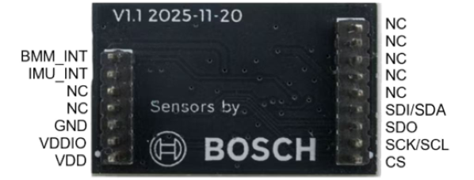
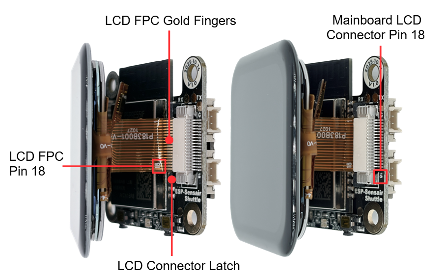

==========================
ESP-SensairShuttle v1.0
==========================

:link_to_translation:`zh_CN:[中文]`

.. note::

  Please check the silkscreen version number on the mainboard (in the white circle at the top right corner of the front or back of the mainboard) to confirm your development board version. For v1.0 development boards, please refer to this user guide.

This guide will help you get started with ESP-SensairShuttle quickly and provide detailed information about this development board.

**ESP-SensairShuttle** is a development board jointly launched by Espressif and **Bosch Sensortec** for **motion sensing** and **large language model human-computer interaction** scenarios, dedicated to promoting the deep integration of multimodal sensing and intelligent interaction technologies. The platform covers typical application scenarios such as **AI toys, smart homes, sports health, and smart offices**, supporting a complete technical chain from environmental sensing, behavior understanding to intelligent feedback, providing a more natural, real-time, and intelligent interaction experience for next-generation intelligent terminals.

ESP-SensairShuttle uses Espressif's **ESP32-C5-WROOM-1-N16R8** module as the main controller, featuring dual-band Wi-Fi 6 (802.11ax) at 2.4 & 5 GHz, Bluetooth® 5 (LE), Zigbee, and Thread (802.15.4) wireless communication capabilities. In addition, the mainboard provides rich peripheral interfaces, including `Bosch Sensortec Shuttle Board <https://www.digikey.sg/en/products/filter/evaluation-boards/expansion-boards-daughter-cards/797?s=N4IgjCBcoLQdIDGUBmBDANgZwKYBoQB7KAbRAA4AmckAXQF96DLSQsALAVwBduMcABACNCaAE4ATAQGYAdAAY6BAKxRQAByhgC6zZErLGQA>`_ (only supports shuttle board 3.0 version) interface, **microphone and speaker interfaces**, and **battery power interface**. Users can flexibly achieve multi-dimensional sensing such as **air quality, gesture actions, attitude direction, and magnetic field information** by replacing different Shuttle sensor daughterboards (Espressif officially supports **BME690** and **BMI270 & BMM350** daughterboards), suitable for teaching demonstrations, algorithm verification, and multi-scenario prototype development.

In terms of audio, ESP-SensairShuttle supports external microphones and speakers, which can seamlessly connect to various **large language models** to achieve natural and smooth AI voice interaction capabilities, suitable for voice interaction products that require large model empowerment such as **AI toys, smart speakers, and smart control panels**.

This guide includes the following content:

- `Getting Started`_: Briefly introduces the development board and hardware and software setup guides.
- `Hardware Reference`_: Details the hardware of the development board.
- `Hardware Revision History`_: Introduces hardware revision history and known issues (if any).
- `Related Documents`_: Lists links to related documents.
- `Disclaimer and Copyright Notice`_: Link to the disclaimer and copyright notice.

.. note::

  For instructions on using the factory firmware, please refer to `ESP-SensairShuttle User Guide <https://espressif.craft.me/JUsLZQOVMBoNdU>`_.

.. _Getting-started_esp-sensairshuttle:

Getting Started
===============

This section will briefly introduce ESP-SensairShuttle and explain how to flash firmware on ESP-SensairShuttle and related preparation work.

Component Overview
------------------

.. figure:: ../../_static/esp-sensairshuttle/esp-sensairshuttle-mainboard-front.png
   :alt: SensairShuttle-Mainboard PCB Front View (Click to enlarge)
   :scale: 70%
   :figclass: align-center

   SensairShuttle-Mainboard PCB Front View (Click to enlarge)

.. figure:: ../../_static/esp-sensairshuttle/esp-sensairshuttle-bme690-front.png
   :alt: ShuttleBoard-BME690 PCB Front View (Click to enlarge)
   :scale: 60%
   :figclass: align-center

   ShuttleBoard-BME690 PCB Front View (Click to enlarge)

.. figure:: ../../_static/esp-sensairshuttle/esp-sensairshuttle-bmi270&bmm350-front.png
   :alt: ShuttleBoard-BMI270&BMM350 PCB Front View (Click to enlarge)
   :scale: 60%
   :figclass: align-center

   ShuttleBoard-BMI270&BMM350 PCB Front View (Click to enlarge)

.. figure:: ../../_static/esp-sensairshuttle/esp-sensairshuttle-lcd.png
   :alt: ESP-SensairShuttle LCD Screen Photo (Click to enlarge)
   :scale: 60%
   :figclass: align-center

   ESP-SensairShuttle LCD Screen Photo (Click to enlarge)

The main components on the front PCB are introduced in clockwise order below.

.. list-table::
   :widths: 30 70
   :header-rows: 1

   * - Main Component
     - Description
   * - :strong:`MainBoard`
     -
   * - External Pin Interface
     - 4-pin external pin interface, from top to bottom: GPIO5, GPIO4, ``VDD``, ``GND``. Note: GPIO5 is not available by default. To use it as an external IO, please install the R14 resistor.
   * - I2C Interface
     - 4-pin external I2C interface, from top to bottom: ``VDD``, ``SCL`` (GPIO3), ``SDA`` (GPIO2), ``GND``. Devices that support the I2C protocol can be connected.
   * - RGB Interface
     - 3-pin external RGB strip interface, from top to bottom: ``DIN`` (GPIO27), ``VDD``, ``GND``. WS2812 and other RGB strips can be connected.
   * - ESP32-C5-WROOM-1-N16R8
     - Main control module, integrated with 16 MB Flash and 8 MB PSRAM, featuring dual-band Wi-Fi 6 (802.11ax) at 2.4 & 5 GHz, Bluetooth® 5 (LE), Zigbee, and Thread (802.15.4) wireless communication capabilities.
   * - LCD Connector
     - Used to connect the LCD screen. SPI signals: ``LCD_SDA`` (GPIO23), ``LCD_SCL`` (GPIO24), ``LCD_CS`` (GPIO25), ``LCD_DC`` (GPIO26).
   * - Boot Button
     - Used to manually enter download mode, can also be used as a regular function button. Connected to GPIO28.
   * - Power Indicator LED
     - Used to indicate device power status. For indicator status details, please refer to the `Power Options`_ section.
   * - Power Switch
     - Used to control device power on/off. Click the power switch to toggle the power state.
   * - :strong:`ShuttleBoard-BME690`
     -
   * - BME690 Sensor
     - BME690 is a Bosch air quality sensor that can measure temperature, humidity, pressure, and gas resistance, and supports both I2C and SPI. The CS pin (``BM_CS``/GPIO10) is pulled high by default for I2C. The I2C address is set by the SDO pin: **0x76** when SDO (``BM_SDO``/GPIO9) is low, and **0x77** when SDO is high.
   * - :strong:`ShuttleBoard-BMI270&BMM350`
     -
   * - BMI270 Sensor
     - BMI270 is a Bosch inertial measurement unit (IMU) that measures three-axis acceleration and three-axis angular velocity, and supports both I2C and SPI. The CS pin (``BM_CS``/GPIO10) is pulled high by default for I2C. The I2C address is set by the SDO pin: **0x68** when SDO (``BM_SDO``/GPIO9) is low, and **0x69** when SDO is high.
   * - BMM350 Sensor
     - BMM350 is a Bosch magnetometer that measures three-axis magnetic field strength over I2C. The I2C address is set by ADSEL: **0x14** when ADSEL is tied to GND, and **0x15** when ADSEL is tied to VDDIO. On this daughterboard ADSEL is grounded, so the address is **0x14**.
   * - LCD Screen
     - Matching LCD screen, model ST7789P3, size 1.83 inches, resolution 240(H) x 284(V), using 4-line SPI interface communication. The screen is connected to the mainboard through the LCD connector, and supports power control via ``PWR_CTRL`` (GPIO5).

.. figure:: ../../_static/esp-sensairshuttle/esp-sensairshuttle-mainboard-back.png
   :alt: SensairShuttle-Mainboard PCB Back View (Click to enlarge)
   :scale: 70%
   :figclass: align-center

   SensairShuttle-Mainboard PCB Back View (Click to enlarge)

.. figure:: ../../_static/esp-sensairshuttle/esp-sensairshuttle-bme690-back.png
   :alt: ShuttleBoard-BME690 PCB Back View (Click to enlarge)
   :scale: 70%
   :figclass: align-center

   ShuttleBoard-BME690 PCB Back View (Click to enlarge)

   ShuttleBoard-BMI270&BMM350 PCB Back View (Click to enlarge)

The main components on the back PCB are introduced in clockwise order below.

.. list-table::
   :widths: 30 70
   :header-rows: 1

   * - Main Component
     - Description
   * - :strong:`MainBoard`
     -
   * - Battery Connector
     - Battery connector that can connect to an external 3.7 V lithium battery, using HC-1.25-2P wire-to-board connector.
   * - Mic Connector
     - 2-wire microphone connector that can connect to an external analog microphone, using HC-1.25-2P wire-to-board connector. The microphone signal is amplified and fed into GPIO6 (ADC channel 5).
   * - Shuttle Board Connector
     - 9+7 pin 1.27 mm female header compatible with Bosch Sensortec Shuttle Board 3.0. It can connect ShuttleBoard-BME690 and ShuttleBoard-BMI270&BMM350 sensor daughterboards. See `Shuttle Board Connector Pins`_ below for pin definitions.
   * - Speaker Connector
     - 2-wire speaker connector that can connect to an external speaker, using HC-1.25-2P wire-to-board connector. The amplifier is controlled by ``PA_CTL`` (GPIO1, active high). Audio is differential PDM: ``PDM_P`` (GPIO7), ``PDM_N`` (GPIO8).
   * - Shuttle Board Voltage Selection Header
     - 3-pin header used with a jumper to select the Shuttle daughterboard voltage (``VDD_SENSOR``) as **3.3 V** or **1.8 V**. Short the corresponding pads according to the operating voltage required by the installed daughterboard. The development kit daughterboards are all supplied at **3.3 V**.
   * - Type-C Port
     - USB-C interface for power supply, program flashing, and debugging, supporting lithium battery charging.
   * - :strong:`ShuttleBoard-BME690`
     - Pin definitions for the sensor daughterboard are marked in the figure.
   * - :strong:`ShuttleBoard-BMI270&BMM350`
     - Pin definitions for the sensor daughterboard are marked in the figure.

.. _shuttle-board-connector-pins:

Shuttle Board Connector Pins
~~~~~~~~~~~~~~~~~~~~~~~~~~~~

The Shuttle connector on the mainboard is compatible with the Bosch Sensortec Shuttle Board 3.0 7+9 pin definition. The table below lists the mapping between each pin signal and the ESP32-C5 GPIO.

.. list-table::
   :widths: 22 18 22 18
   :header-rows: 1

   * - 9-pin Signal
     - Mainboard Side
     - 7-pin Signal
     - Mainboard Side
   * - PROM-RW
     - NC
     -
     -
   * - NC
     - NC
     -
     -
   * - NC
     - NC
     - INT2
     - GPIO0
   * - NC
     - NC
     - INT1
     - GPIO28
   * - NC
     - NC
     - NC
     - NC
   * - SDI/SDA
     - GPIO2
     - NC
     - NC
   * - SDO
     - GPIO9
     - GND
     - GND
   * - SCK/SCL
     - GPIO3
     - VDDIO
     - VDD_SENSOR
   * - CS
     - GPIO10
     - VDD
     - VDD_SENSOR

.. note::

   - The default interface is **I2C**. The interface is selected by ``BM_CS``/GPIO10: keep it high for I2C, or drive it low for SPI.
   - The I2C slave address is selected by ``BM_SDO``/GPIO9: low selects the primary address, high selects the secondary address.
   - For more electrical details, see `Shuttle Board Interface Circuit`_.

Application Examples
--------------------

The following are application examples for the development board:

- :project:`ESP-SensairShuttle Factory Demo <examples/esp-sensairshuttle/examples/factory_demo>` - A full-featured demo system based on the ESP-Brookesia framework, showcasing an app-based UI management system and multiple demo applications (e.g., compass, temperature & air quality monitoring, gesture recognition).

For more examples and the latest updates, please refer to the :project:`examples <examples/esp-sensairshuttle>` folder.

To try the examples or develop custom applications, please follow the steps in the `Start Development`_ section.

Start Development
-----------------

Before powering on, please ensure that ESP-SensairShuttle is intact.

Required Hardware
~~~~~~~~~~~~~~~~~

- ESP-SensairShuttle mainboard, ShuttleBoard-BME690 daughterboard, ShuttleBoard-BMI270&BMM350 daughterboard, LCD screen
- USB cable
- Computer (Windows, Linux, or macOS)

.. note::

  Please ensure you use an appropriate USB cable. Some cables can only be used for charging and cannot be used for data transmission and programming.

Hardware Setup
~~~~~~~~~~~~~~

LCD Screen Cable Installation
^^^^^^^^^^^^^^^^^^^^^^^^^^^^^

Before starting to use the development board, please follow the steps below to install the LCD screen cable:

1. **Confirm Cable Orientation**: Place the LCD screen cable with the gold fingers facing up, ensuring the cable orientation is correct (the pin number [18] on the screen cable should correspond to the pin number [18] on the PCB).

2. **Insert Cable**: First, release the black lock of the LCD connector, then insert the screen cable into the LCD connector on the mainboard. When inserting, ensure the screen cable is aligned with the connector. You can use **tweezers** to assist if it is inconvenient to install by hand.

3. **Lock Connector**: Lock the black lock of the LCD connector to ensure the screen cable is securely connected.

   LCD Screen Cable Installation Diagram (Click to enlarge)

.. warning::

   - Do not use excessive force when installing the cable to avoid damaging the cable or connector.
   - Ensure the cable orientation is correct. An incorrect orientation will cause the screen not to light up.
   - If you need to remove the cable, first unlock the connector, then gently pull it out. Avoid directly pulling the cable.

USB Connection
^^^^^^^^^^^^^^

Connect ESP-SensairShuttle to your computer using a USB cable, and flash firmware, debug, and power supply through the ``Type-C (USB-C Interface)``.

Software Setup
~~~~~~~~~~~~~~

Please visit the `ESP-IDF Getting Started <https://docs.espressif.com/projects/esp-idf/en/latest/esp32c5/get-started/index.html>`__ section to learn how to quickly set up the development environment and flash applications to your development board.

.. note::

  The development board uses a USB port to communicate with the computer. Most operating systems (Windows, Linux, macOS) have the required drivers pre-installed, and the development board can be automatically recognized after insertion. If the device cannot be recognized or a serial connection cannot be established, please refer to `Establish Serial Connection <https://docs.espressif.com/projects/esp-idf/en/latest/esp32c5/get-started/establish-serial-connection.html>`__ for detailed steps on installing drivers.

Hardware Reference
==================

Function Block Diagram
----------------------

The main components and connection methods of ESP-SensairShuttle are shown in the figure below.

.. figure:: ../../_static/esp-sensairshuttle/esp-sensairshuttle-sch-function-block_v1_0.png
   :alt: ESP-SensairShuttle Function Block Diagram (Click to enlarge)
   :scale: 32%
   :figclass: align-center

   ESP-SensairShuttle Function Block Diagram (Click to enlarge)

Power Options
-------------

The development board can be powered by the following methods:

1. Power via ``Type-C (USB-C Interface)``

   When using this method, connect the Type-C interface on the device using a USB Type-C cable.
   If no lithium battery is installed, the power indicator LED will be green. If a lithium battery is installed, press the ``POWER`` button to turn on the device. At this time, the power indicator LED will be yellow (battery is charging) or green (battery is fully charged).

2. Power via ``Battery``

   The device can connect to an external 3.7V lithium battery. Press the ``POWER`` button to power the device. The power indicator LED will be green when the device is on, and off when the device is off.

Type-C Interface
-----------------

.. figure:: ../../_static/esp-sensairshuttle/esp-sensairshuttle-mainboard-sch-type-c-v1_0.png
   :alt: Type-C Interface Circuit Diagram (Click to enlarge)
   :scale: 50%
   :figclass: align-center

   Type-C Interface Circuit Diagram (Click to enlarge)

LCD Interface
-------------

.. figure:: ../../_static/esp-sensairshuttle/esp-sensairshuttle-mainboard-sch-lcd-v1_0.png
   :alt: LCD Interface Circuit Diagram (Click to enlarge)
   :scale: 50%
   :figclass: align-center

   LCD Interface Circuit Diagram (Click to enlarge)

The X1 interface is the LCD screen interface in use. The matching LCD screen specifications for this development board are as follows:

- **Screen Size**: 1.83 inches
- **Resolution**: 240(H) x 284(V)
- **Driver Chip**: ST7789P3
- **Communication Interface**: 4-line SPI Interface
- **Power Control**: Supports controlling screen power on/off via ``PWR_CTRL`` (GPIO5)

For more detailed information, please refer to the `Display Specification`_.

Power Switch Circuit
-------------------------

.. figure:: ../../_static/esp-sensairshuttle/esp-sensairshuttle-mainboard-sch-powerswitch-v1_0.png
   :alt: Power Switch Circuit Diagram (Click to enlarge)
   :scale: 40%
   :figclass: align-center

   Power Switch Circuit Diagram (Click to enlarge)

Battery Charging Circuit
-----------------------------

.. figure:: ../../_static/esp-sensairshuttle/esp-sensairshuttle-mainboard-sch-battery-charge-v1_0.png
   :alt: Battery Charging Circuit Diagram (Click to enlarge)
   :scale: 50%
   :figclass: align-center

   Battery Charging Circuit Diagram (Click to enlarge)

Shuttle Board Interface Circuit
-------------------------------------

.. figure:: ../../_static/esp-sensairshuttle/esp-sensairshuttle-mainboard-sch-shuttle-board-connector-v1_0.png
   :alt: Shuttle Board Interface Circuit Diagram (Click to enlarge)
   :scale: 50%
   :figclass: align-center

   Shuttle Board Interface Circuit Diagram (Click to enlarge)

I2C/RGB/External Pin Interface
-----------------------------------

.. figure:: ../../_static/esp-sensairshuttle/esp-sensairshuttle-mainboard-sch-external-interface-v1_0.png
   :alt: I2C/RGB/External Pin Interface Circuit Diagram (Click to enlarge)
   :scale: 45%
   :figclass: align-center

   I2C/RGB/External Pin Interface Circuit Diagram (Click to enlarge)

Hardware Revision History
==============================

No revision history.

.. _Related-documents_esp-sensairshuttle:

Related Documents
=====================

-  `ESP32-C5 Datasheet`_ (PDF)
-  `ESP32-C5-WROOM-1 & ESP32-C5-WROOM-1U Datasheet`_ (PDF)
-  `Espressif Product Selector`_
-  `ESP-SensairShuttle-Mainboard V1.0 Schematic`_ (PDF)
-  `ESP-SensairShuttle-Mainboard V1.0 PCB Layout`_ (PDF)
-  `ESP-SensairShuttle-ShuttleBoard-BME690 V1.0 Schematic`_ (PDF)
-  `ESP-SensairShuttle-ShuttleBoard-BME690 V1.0 PCB Layout`_ (PDF)
-  `ESP-SensairShuttle-ShuttleBoard-BMI270&BMM350 V1.0 Schematic`_ (PDF)
-  `ESP-SensairShuttle-ShuttleBoard-BMI270&BMM350 V1.0 PCB Layout`_ (PDF)
-  `Display Specification`_ (PDF)
-  `Gas Sensor BME690 Official Data Sheet`_
-  `Inertial Measurement Unit BMI270 Official Data Sheet`_
-  `Magnetometer BMM350 Official Data Sheet`_
-  `Open-source Enclosure`_

.. _ESP32-C5 Datasheet: https://documentation.espressif.com/esp32-c5_datasheet_en.pdf
.. _ESP32-C5-WROOM-1 & ESP32-C5-WROOM-1U Datasheet: https://documentation.espressif.com/esp32-c5-wroom-1_wroom-1u_datasheet_en.html
.. _Espressif Product Selector: https://products.espressif.com/#/product-selector?names=
.. _ESP-SensairShuttle-Mainboard V1.0 Schematic: https://dl.espressif.com/AE/esp-dev-kits/SCH_SCH-ESP-SensairShuttle-MainBoard-V1_0_2025-12-16.pdf
.. _ESP-SensairShuttle-Mainboard V1.0 PCB Layout: https://dl.espressif.com/AE/esp-dev-kits/PCB_PCB-ESP-SensairShuttle-MainBoard-V1_0_2025-12-16.pdf
.. _ESP-SensairShuttle-ShuttleBoard-BME690 V1.0 Schematic: https://dl.espressif.com/AE/esp-dev-kits/SCH_SCH-ShuttleBoard-BME690-V1_0_2025-12-16.pdf
.. _ESP-SensairShuttle-ShuttleBoard-BME690 V1.0 PCB Layout: https://dl.espressif.com/AE/esp-dev-kits/PCB_PCB-ShuttleBoard-BME690-V1_0_2025-12-16.pdf
.. _ESP-SensairShuttle-ShuttleBoard-BMI270&BMM350 V1.0 Schematic: https://dl.espressif.com/AE/esp-dev-kits/SCH_SCH-ShuttleBoard-BMI270&BMM350-V1_1_2025-12-16.pdf
.. _ESP-SensairShuttle-ShuttleBoard-BMI270&BMM350 V1.0 PCB Layout: https://dl.espressif.com/AE/esp-dev-kits/PCB_PCB-ShuttleBoard-BMI270&BMM350-V1_1_2025-12-16.pdf
.. _Display Specification: https://dl.espressif.com/AE/esp-dev-kits/1.83-inch-LCD-P183B001-V4-CTP.pdf
.. _Gas Sensor BME690 Official Data Sheet: https://www.bosch-sensortec.com/media/boschsensortec/downloads/datasheets/bst-bme690-ds001.pdf
.. _Inertial Measurement Unit BMI270 Official Data Sheet: https://www.bosch-sensortec.com/products/motion-sensors/imus/bmi270/
.. _Magnetometer BMM350 Official Data Sheet: https://www.bosch-sensortec.com/products/motion-sensors/magnetometers/bmm350/
.. _Open-source Enclosure: https://makerworld.com/en/collections/15813126-esp-sensairshuttle

Disclaimer and Copyright Notice
===============================

See :doc:`Disclaimer and Copyright Notice <../disclaimer-and-copyright>`.

