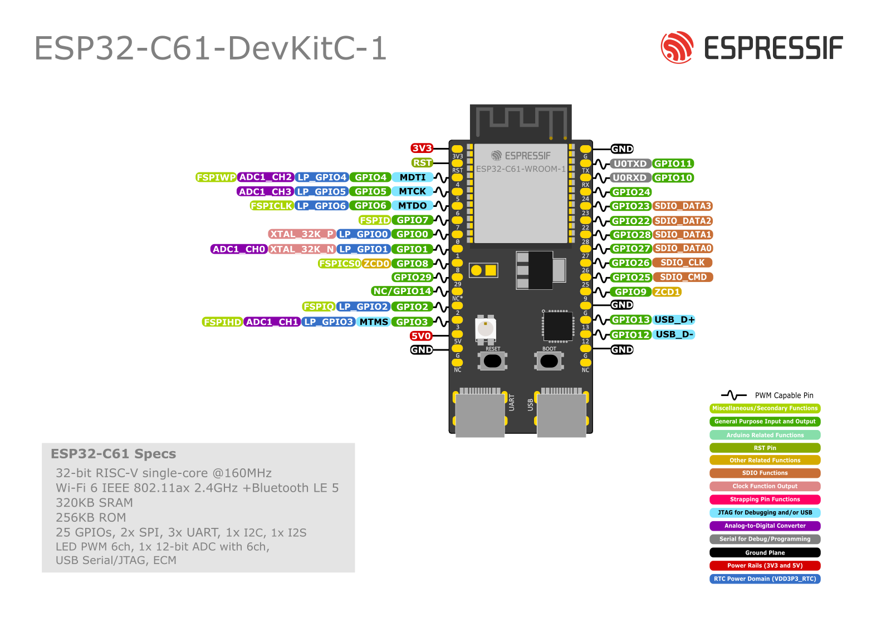

===========================
ESP32-C61-DevKitC-1 v2.0
===========================

:link_to_translation:`zh_CN:[中文]`

Older version: :doc:`user_guide_v1.0`

This user guide will help you get started with ESP32-C61-DevKitC-1 and will also provide more in-depth information.

ESP32-C61-DevKitC-1 is an entry-level development board based on `ESP32-C61-WROOM-1 <https://www.espressif.com/sites/default/files/documentation/esp32-c61-wroom-1_wroom-1u_datasheet_en.pdf>`_. The module integrated on this board comes with up to 8 MB of SPI flash and 2 MB of PSRAM. This board integrates complete Wi-Fi, and Bluetooth® Low Energy functions.

Most of the I/O pins are broken out to the pin headers on both sides for easy interfacing. Developers can either connect peripherals with jumper wires or mount ESP32-C61-DevKitC-1 on a breadboard.

.. figure:: ../../_static/esp32-c61-devkitc-1/esp32-c61-devkitc-1-isometric.png
    :align: center
    :scale: 20%
    :alt: ESP32-C61-DevKitC-1
    :figclass: align-center

    ESP32-C61-DevKitC-1 (click to enlarge)

The document consists of the following major sections:

- `Getting Started`_: Overview of the board and hardware/software setup instructions to get started.
- `Hardware Reference`_: More detailed information about the board's hardware.
- `Hardware Revision Details`_: Hardware revision history and known issues (if any) of the board.
- `Related Documents`_: Links to related documentation.
- `Disclaimer and Copyright Notice`_: Link to the disclaimer and copyright notice.

Getting Started
===============

This section provides a brief introduction of ESP32-C61-DevKitC-1, instructions on how to do the initial hardware setup and how to flash firmware onto it.

Description of Components
-------------------------

.. _user-guide-c61-devkitc-1-v2-board-front:

.. figure:: ../../_static/esp32-c61-devkitc-1/esp32-c61-devkitc-1-v1-annotated-photo.png
    :align: center
    :alt: ESP32-C61-DevKitC-1 - front
    :figclass: align-center

    ESP32-C61-DevKitC-1 - front

The key components of the board are described in a clockwise direction.

.. list-table::
   :widths: 30 70
   :header-rows: 1

   * - Key Component
     - Description
   * - ESP32-C61-WROOM-1
     - ESP32-C61-WROOM-1 is a general-purpose module supporting Wi-Fi 6 in 2.4 GHz band and Bluetooth 5. Built around the ESP32-C61HR2 chip, this module comes with a PCB antenna and offers up to 8 MB SPI flash and 2 MB PSRAM.
   * - Pin Header
     - All available GPIO pins (except for the SPI bus for flash and PSRAM) are broken out to the pin headers on the board.
   * - 5 V to 3.3 V LDO
     - Power regulator that converts a 5 V supply into a 3.3 V output.
   * - 3.3 V Power On LED
     - Turns on when the USB power is connected to the board.
   * - USB-to-UART Bridge
     - Single USB-to-UART bridge chip provides transfer rates up to 3 Mbps.
   * - ESP32-C61 USB Type-C Port
     - The USB Type-C port on the ESP32-C61 chip compliant with USB 2.0 full speed. It is capable of up to 12 Mbps transfer speed (Note that this port does not support the faster 480 Mbps high-speed transfer mode). This port is used for power supply to the board, for flashing applications to the chip, for communication with the chip using USB protocols, as well as for JTAG debugging.
   * - Boot Button
     - Download button. Holding down **Boot** and then pressing **Reset** initiates Firmware Download mode for downloading firmware through the serial port.
   * - Reset Button
     - Press this button to restart the system.
   * - USB Type-C to UART Port
     - Used for power supply to the board, flashing applications to the chip, as well as communication with the ESP32-C61 chip via the on-board USB-to-UART bridge.
   * - RGB LED
     - Addressable RGB LED, driven by GPIO8.
   * - J5
     - Used for current measurement. See details in Section :ref:`user-guide-c61-devkitc-1-v2-current`.

Start Application Development
-----------------------------

Before powering up your board, please make sure that it is in good condition with no obvious signs of damage.

Required Hardware
^^^^^^^^^^^^^^^^^

- ESP32-C61-DevKitC-1
- USB-A to USB-C cable
- Computer running Windows, Linux, or macOS

.. note::

  Be sure to use a good quality USB cable. Some cables are for charging only and do not provide the needed data lines nor work for programming the boards.

Hardware Setup
^^^^^^^^^^^^^^

.. - Varying content - Specify which USB port to use for connection with PC.

Connect the board to your computer using the **USB Type-C to UART Port**. Connection using the **ESP32-C61 USB Type-C Port** is not fully implemented in software. In the subsequent steps, the **USB Type-C to UART Port** will be used by default.

Software Setup
^^^^^^^^^^^^^^

Please proceed to `ESP-IDF Get Started <https://docs.espressif.com/projects/esp-idf/en/latest/esp32c61/get-started/index.html>`__ to set up the development environment and flash an application example onto your board.

.. note::

  In most cases USB drivers required to operate the board are already included in Windows, Linux, and macOS operating systems. Some additional port access or security configuration may be required depending on your OS. In case of issues please check documentation on `how to establish serial connection <https://docs.espressif.com/projects/esp-idf/en/latest/esp32/get-started/establish-serial-connection.html>`__ with the board. The documentation also includes links to USB drivers applicable to boards produced by Espressif.

Espressif provides Board Support Packages (BSPs) for various Espressif boards that help you initialize and use key onboard peripherals, such as LCD displays, audio chips, buttons, and LEDs, more easily and efficiently. For a complete list of supported boards, please visit `esp-bsp <https://github.com/espressif/esp-bsp>`__.

.. Other Development Framework Options
.. ^^^^^^^^^^^^^^^^^^^^^^^^^^^^^^^^^^^^^^^

.. ----------------------------------------------------------------------------
.. - Semi-fixed content, depending on whether the chip series supports the frameworks
.. ----------------------------------------------------------------------------

.. In addition to the ESP-IDF development framework, this development board also supports the following alternative frameworks, providing more flexibility for various user needs and application scenarios:

.. `ESP-AT <https://docs.espressif.com/projects/esp-at/en/latest/esp32/#>`__: Uses AT commands over UART to control the board, without needing to write embedded code.

.. `Arduino-ESP32 <https://docs.espressif.com/projects/arduino-esp32/en/latest/#>`__: Arduino core based on ESP-IDF, offering a simplified API and Arduino ecosystem compatibility.

.. `ESP RainMaker <https://docs.rainmaker.espressif.com/docs/product_overview/technical_overview/introduction/>`__: A highly customizable IoT platform that provides device firmware, phone apps, cloud backend, voice assistant integrations, and device management dashboard.

Contents and Packaging
----------------------

This section provides information about packaging and contents for retail and wholesale orders. The development board has a variety of variants to choose from. Please visit the `ESP Product Selector <https://products.espressif.com/#/product-selector?names=>`__, select the **Development Board** tab, and review the comprehensive list of available board variants.

Retail orders
^^^^^^^^^^^^^

If you order a few samples, each ESP32-C61-DevKitC-1 comes in an individual package in either antistatic bag or any packaging depending on your retailer.

For retail orders, please go to https://www.espressif.com/en/company/contact/buy-a-sample.

Wholesale Orders
^^^^^^^^^^^^^^^^

If you order in bulk, the boards come in large cardboard boxes.

For wholesale orders, please go to https://www.espressif.com/en/contact-us/sales-questions.

Hardware Reference
==================

Block Diagram
-------------

The block diagram below shows the components of ESP32-C61-DevKitC-1 and their interconnections.

.. figure:: ../../_static/esp32-c61-devkitc-1/esp32-c61-devkitc-1-v1-block-diagram.png
    :align: center
    :scale: 60%
    :alt: ESP32-C61-DevKitC-1
    :figclass: align-center

    ESP32-C61-DevKitC-1 (click to enlarge)

Power Supply Options
--------------------

There are three mutually exclusive ways to provide power to the board:

- USB Type-C to UART Port and ESP32-C61 USB Type-C Port (either one or both), default power supply (recommended)
- 5V and GND pin headers
- 3V3 and GND pin headers

.. note::

  The board operates at a 5 V power supply and requires a minimum current of 0.5 A. If your application demands a current exceeding 0.5 A, consider connecting the board via a powered USB hub to ensure stable operation.

.. _user-guide-c61-devkitc-1-v2-current:

Current Measurement
-------------------

The J5 headers on ESP32-C61-DevKitC-1 (see J5 in Figure :ref:`user-guide-c61-devkitc-1-v2-board-front`) can be used for measuring the current drawn by the ESP32-C61-WROOM-1 module:

- Remove the jumper: Power supply between the module and peripherals on the board is cut off. To measure the module's current, connect the board with an ammeter via J5 headers.
- Apply the jumper (factory default): Restore the board's normal functionality.

.. note::

  When using 3V3 and GND pin headers to power the board, please remove the J5 jumper, and connect an ammeter in series to the external circuit to measure the module's current.

Header Block
-------------

The two tables below provide the **Name** and **Function** of the pin headers on both sides of the board (J1 and J3). The pin header names are shown in Figure :ref:`user-guide-c61-devkitc-1-v2-board-front`. The numbering is the same as in the `ESP32-C61-DevKitC-1 Schematic`_ (PDF).

J1
^^^
===  =======  ==========  =================================================
No.  Name     Type [1]_    Function
===  =======  ==========  =================================================
1    3V3       P          3.3 V power supply
2    RST       I          High: enables the chip; Low: disables the chip.
3    4         I/O/T      MTDI, GPIO4, LP_GPIO4, ADC1_CH2, FSPIWP
4    5         I/O/T      MTCK, GPIO5, LP_GPIO5, ADC1_CH3
5    6         I/O/T      MTDO, GPIO6, LP_GPIO6, FSPICLK
6    7         I/O/T      GPIO7 [3]_, FSPID
7    0         I/O/T      GPIO0, XTAL_32K_P, LP_GPIO0
8    1         I/O/T      GPIO1, XTAL_32K_N, LP_GPIO1, ADC1_CH0
9    8         I/O/T      GPIO8 [2]_ [3]_, ZCD0, FSPICS0
10   29        I/O/T      GPIO29
11   NC/14     I/O/T      No connection/GPIO14 [4]_
12   2         I/O/T      GPIO2, LP_GPIO2, FSPIQ
13   3         I/O/T      MTMS, GPIO3, LP_GPIO3, ADC1_CH1, FSPIHD
14   5V        P          5 V power supply
15   G         G          Ground
16   NC        --         No connection
===  =======  ==========  =================================================

J3
^^^
===  ==========  ======  ==========================================
No.   Name       Type    Function
===  ==========  ======  ==========================================
1      G          G       Ground
2      TX         I/O/T   U0TXD, GPIO11
3      RX         I/O/T   U0RXD, GPIO10
4      24         I/O/T   GPIO24
5      23         I/O/T   GPIO23, SDIO_DATA3
6      22         I/O/T   GPIO22, SDIO_DATA2
7      28         I/O/T   GPIO28, SDIO_DATA1
8      27         I/O/T   GPIO27, SDIO_DATA0
9      26         I/O/T   GPIO26, SDIO_CLK
10     25         I/O/T   GPIO25, SDIO_CMD
11     9          I/O/T   GPIO9 [3]_, ZCD1
12     G          G       Ground
13     13         I/O/T   GPIO13, USB_D+
14     12         I/O/T   GPIO12, USB_D-
15    G          G       Ground
16    NC         --      No connection
===  ==========  ======  ==========================================

.. [1] P: Power supply; I: Input; O: Output; T: High impedance.
.. [2] Used to drive the RGB LED.
.. [3] GPIO7, GPIO8, and GPIO9 are strapping pins of the ESP32-C61 chip. These pins are used to control several chip functions depending on binary voltage values applied to the pins during chip power-up or system reset. For description and application of the strapping pins, please refer to `ESP32-C61 Datasheet`_ > Section *Boot Configurations*.
.. [4] For the module with integrated SPI PSRAM, this pin is already used as SPICS1 and cannot be used for other functions; for the module without integrated SPI PSRAM, this pin can be used as GPIO14.

Pin Layout
^^^^^^^^^^^

    ESP32-C61-DevKitC-1 Pin Layout (click to enlarge)

Hardware Revision Details
=========================

Revision History
----------------

- ESP32-C61-DevKitC-1 v2.0: For boards with the PW number of and after PW-2025-05-0781, J1 and J3 functions are updated. See details in Section `Header Block`_.

- :doc:`ESP32-C61-DevKitC-1 v1.0 <user_guide_v1.0>` was the initial release.

.. note::

  The PW number can be found in the product label on the large cardboard boxes for wholesale orders.

Related Documents
=================

.. only:: latex

   Please download the following documents from `the HTML version of esp-dev-kits Documentation <https://docs.espressif.com/projects/esp-dev-kits/en/latest/{IDF_TARGET_PATH_NAME}/index.html>`_.

* `ESP32-C61 Datasheet`_ (PDF)
* `ESP32-C61-WROOM-1 Datasheet`_ (PDF)

* `ESP32-C61-DevKitC-1 Schematic`_ (PDF)
* `ESP32-C61-DevKitC-1 PCB Layout`_ (PDF)
* `ESP32-C61-DevKitC-1 Dimensions`_ (PDF)
* `ESP32-C61-DevKitC-1 Dimensions source file`_ (DXF)

For further design documentation for the board, please contact us at `sales@espressif.com <sales@espressif.com>`_.

.. _ESP32-C61 Datasheet: https://www.espressif.com/sites/default/files/documentation/esp32-c61_datasheet_en.pdf
.. _ESP32-C61-WROOM-1 Datasheet: https://www.espressif.com/sites/default/files/documentation/esp32-c61-wroom-1_wroom-1u_datasheet_en.pdf
.. _ESP32-C61-DevKitC-1 Schematic: https://dl.espressif.com/dl/schematics/esp32-c61-devkitc-1-schematics_v2.0.pdf
.. _ESP32-C61-DevKitC-1 PCB Layout: https://dl.espressif.com/dl/schematics/esp32-c61-devkitc-1-pcb-layout_v2.0.pdf
.. _ESP32-C61-DevKitC-1 Dimensions: https://dl.espressif.com/dl/schematics/esp32-c61-devkitc-1-dimensions_v2.0.pdf
.. _ESP32-C61-DevKitC-1 Dimensions source file: https://dl.espressif.com/dl/schematics/ESP32-C61-DevKitC-1-dimensions_v2.0.dxf

.. toctree::
    :hidden:

    user_guide_v1.0

Disclaimer and Copyright Notice
===============================

See :doc:`Disclaimer and Copyright Notice <../disclaimer-and-copyright>`.

