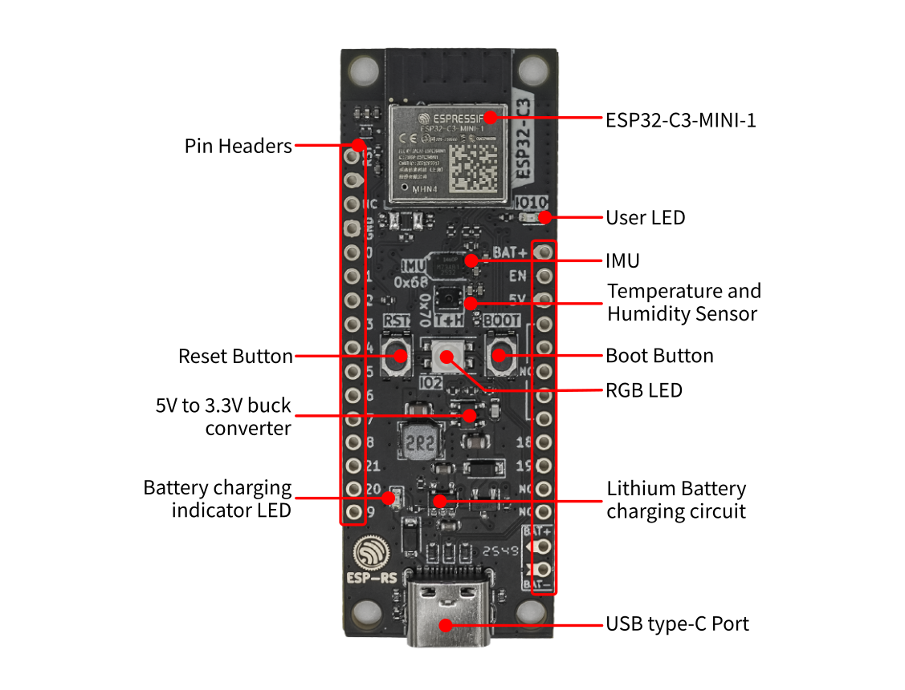
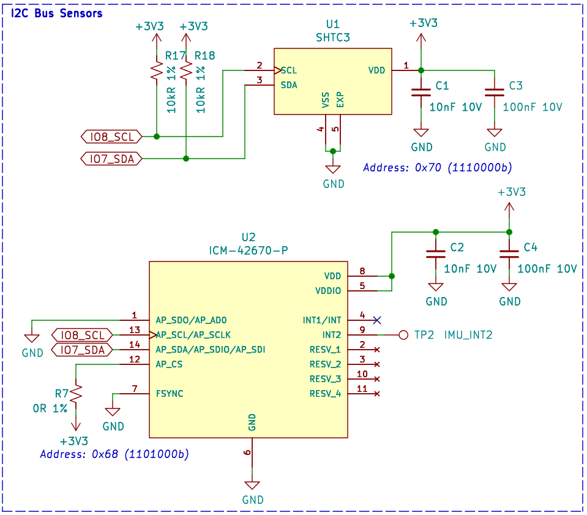
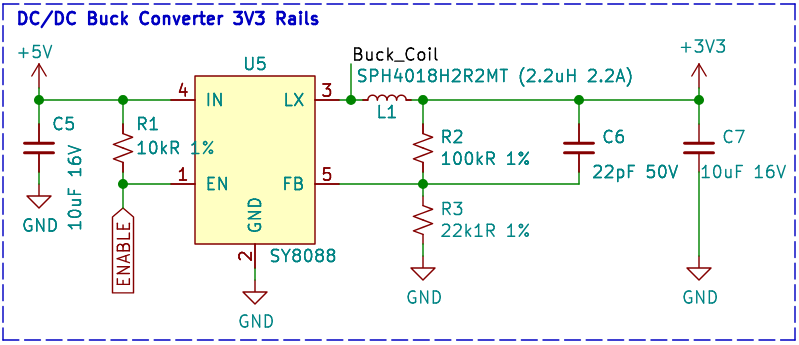
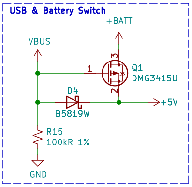
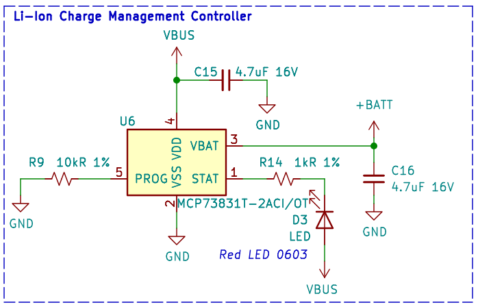
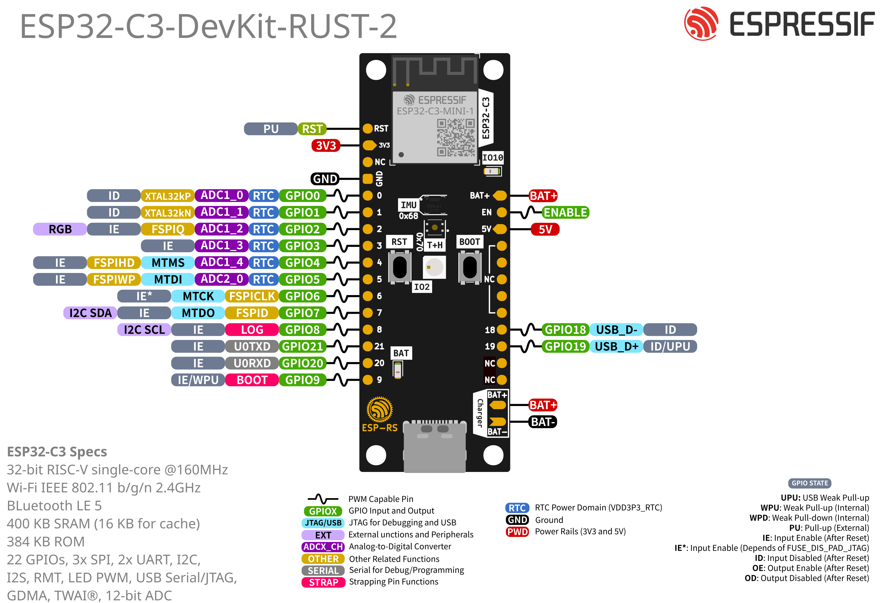

======================
ESP32-C3-DevKit-RUST-2
======================

:link_to_translation:`en: [English]`

本指南将帮助你快速上手 ESP32-C3-DevKit-RUST-2，并提供该款开发板开发和集成的详细信息。
ESP32-C3-DevKit-RUST-2 开发板使用配置 4 MB SPI flash 的模组 ESP32-C3-MINI-1。该开发板具备完整的 Wi-Fi 和低功耗蓝牙® 功能，适合多种物联网和嵌入式应用。

除了 ESP32-C3 芯片外，该开发板还集成了板载传感器和锂离子电池充电电路，无需外部元器件便能实现基于传感器的便携式应用。

板上模组大部分管脚均已引出至两侧排针，开发人员可根据实际需求，轻松通过跳线将外部元器件连接至 ESP32-C3 的外设接口，同时也可将开发板插在面包板上快速构建原型。

.. figure:: ../../_static/esp32-c3-devkit-rust-2/esp32-c3-devkit-rust-2-isometric.png
    :align: center
    :scale: 18%
    :alt: ESP32-C3-DevKit-RUST-2
    :figclass: align-center

    ESP32-C3-DevKit-RUST-2

本指南包括如下内容：

- `入门指南`_：简要介绍了 ESP32-C3-DevKit-RUST-2 和硬件、软件设置指南。
- `硬件参考`_：详细介绍了 ESP32-C3-DevKit-RUST-2 的硬件。
- `硬件版本`_：介绍硬件历史版本和已知问题，并提供历史版本开发板的入门指南链接（如有）。
- `相关文档`_：列出了相关文档的链接。

入门指南
========

本小节将简要介绍 ESP32-C3-DevKit-RUST-2，说明如何在 ESP32-C3-DevKit-RUST-2 上烧录固件及相关准备工作。

组件介绍
--------

.. _user-guide-c3-devkit-rust-2-board-front:

    ESP32-C3-DevKit-RUST-2（搭载 ESP32-C3-MINI-1 模组） - 正面

以下按照顺时针顺序依次介绍开发板上的主要组件，从模组开始。

.. list-table::
   :widths: 30 70
   :header-rows: 1

   * - 主要组件
     - 介绍
   * - ESP32-C3-MINI-1
     - ESP32-C3-MINI-1 是乐鑫推出的通用型 Wi-Fi 和低功耗蓝牙®双模模组，内置 4 MB flash。
   * - User LED（用户 LED）
     - 用户定义的 GPIO LED，连接 **GPIO10**。
   * - IMU
     - 惯性测量单元 (IMU) ICM-42670-P，通过 I2C 接口连接。
   * - Temperature and Humidity Sensor（温湿度传感器）
     - 温湿度传感器 SHTC3，通过 I2C 接口连接。
   * - Boot Button（Boot 键）
     - 下载按键。按住 **Boot** 键的同时按一下 **Reset** 键进入“固件下载”模式，通过串口下载固件。
   * - RGB LED
     - 可寻址 RGB LED，由 GPIO2 驱动。
   * - Lithium Battery charging circuit（锂离子电池充电电路 ）
     - 为单电芯锂离子电池充电的内置充电电路。
   * - USB type-C Port（USB Type-C 接口）
     - USB-CDC 接口。可作为开发板的供电接口，也可作为计算机和 ESP32-C3 芯片之间的通信接口（烧录和调试）。
   * - Battery charging indicator LED（电池充电指示灯）
     - 红色 LED 指示电池正在充电。
   * - 5V to 3.3V buck converter（5V 转 3.3V 降压转换器）
     - 电源转换器，输入 5 V，输出 3.3 V。
   * - Reset Button（Reset 键）
     - 复位按键。
   * - Pin Headers（排针）
     - 大部分可用 GPIO 管脚均已引出至排针，方便外部访问。更多信息，请参考 :ref:`user-guide-c3-devkit-rust-2-header-blocks`。

应用示例
--------

以下为 ESP32-C3-DevKit-RUST-2 的应用示例：

- `ESP-IDF Basic Workshop <https://github.com/espressif/developer-portal-codebase/tree/main/content/workshops/esp-idf-basic>`_
- `ESP-IDF Advanced Workshop <https://github.com/espressif/developer-portal-codebase/tree/main/content/workshops/esp-idf-advanced>`_

如需尝试应用示例或开发自定义应用，请参照 `开始开发应用`_ 小节中的步骤进行操作。

开始开发应用
------------

通电前，请确保 ESP32-C3-DevKit-RUST-2 完好无损。

必备硬件
^^^^^^^^

- ESP32-C3-DevKit-RUST-2
- USB 2.0 数据线（USB Type-C）
- 电脑（Windows、Linux 或 macOS）

.. 注解::

  请确保使用适当的 USB 数据线。部分数据线仅可用于充电，无法用于数据传输和编程。

硬件设置
^^^^^^^^

通过 **USB Type-C 接口** 连接开发板和电脑。

软件设置
^^^^^^^^

请前往 `ESP-IDF 快速入门 <https://docs.espressif.com/projects/esp-idf/zh_CN/latest/esp32c3/get-started/index.html>`__ 小节，查看如何快速设置开发环境，将应用程序烧录至你的开发板。

内含组件和包装
--------------

零售订单
^^^^^^^^

如购买样品，每个 ESP32-C3-DevKit-RUST-2 开发板将以防静电袋或零售商选择的其他方式包装。

零售订单请前往 https://www.espressif.com/zh-hans/contact-us/get-samples。

硬件参考
========

功能框图
--------

ESP32-C3-DevKit-RUST-2 的主要组件和连接方式如下图所示。

.. figure:: ../../_static/esp32-c3-devkit-rust-2/esp32-c3-devkit-rust-2-diagram.png
    :align: center
    :alt: ESP32-C3-DevKit-RUST-2（点击放大）
    :figclass: align-center

    ESP32-C3-DevKit-RUST-2（点击放大）

电源选项
^^^^^^^^

您可从以下三种供电方式中任选其一给开发板供电：

- USB Type-C 接口供电（默认供电方式）
- 5V 和 GND 排针供电
- BAT 和 GND 排针供电（用于单电芯锂离子电池）

建议选择第一种供电方式：USB Type-C 接口供电。

.. 注解::

  该开发板工作电压为 5 V，所需最小电流为 0.5 A。如果应用所需电流超过 0.5 A，建议通过 USB 集线器给开发板供电，以确保其稳定运行。

.. _user-guide-c3-devkit-rust-2-header-blocks:

排针
----

下表列出了开发板两侧排针（左侧和右侧）的 **名称** 和 **功能**，排针的名称如图 :ref:`user-guide-c3-devkit-rust-2-board-front` 所示，排针的序号与 `ESP32-C3-DevKit-RUST-2 原理图`_ (PDF) 一致。

左侧排针
^^^^^^^^

====  ====  ==========  =================================================
序号  名称  类型 [1]_   功能
====  ====  ==========  =================================================
1     RST   I           EN / CHIP_PU
2     3V3   P           3.3 V 电源
3     N/C               未连接
4     GND   G           接地
5     IO0   I/O/T       GPIO0, ADC1_CH0
6     IO1   I/O/T       GPIO1, ADC1_CH1
7     IO2   I/O/T       GPIO2 [2]_, ADC1_CH2
8     IO3   I/O/T       GPIO3, ADC1_CH3
9     IO4   I/O/T       GPIO4, ADC2_CH0
10    IO5   I/O/T       GPIO5, ADC2_CH1
11    IO6   I/O/T       GPIO6, MTCK
12    IO7   I/O/T       GPIO7, MTDO, LED
13    IO8   I/O/T       GPIO8 [2]_, LOG
14    RX    I/O/T       GPIO21, U0RXD
15    TX    I/O/T       GPIO20, U0TXD
16    IO9   I/O/T       GPIO9 [2]_, BOOT
====  ====  ==========  =================================================

右侧排针
^^^^^^^^

====  ====  ==========  =================================================
序号  名称  类型 [1]_   功能
====  ====  ==========  =================================================
1     BAT+  P           电池供电
2     EN    I           使能
3     5V    P           5 V 电源
4     N/C               未连接
5     N/C               未连接
6     N/C               未连接
7     N/C               未连接
8     N/C               未连接
9     IO18  I/O/T       GPIO18, USB_D-
10    IO19  I/O/T       GPIO19, USB_D+
11    N/C               未连接
12    N/C               未连接
====  ====  ==========  =================================================

.. [1] P：电源供应；I：输入； O：输出； T：可设置为高阻。
.. [2] GPIO2、GPIO8 和 GPIO9 为 ESP32-C3 芯片的 Strapping 管脚。在芯片上电和系统复位过程中，Strapping 管脚根据管脚的二进制电压值控制芯片功能。Strapping 管脚的具体描述和应用，请参考 `ESP32-C3 技术规格书`_ 的启动配置项章节。

I2C 外设
^^^^^^^^

========================  =================  ===========
外设                       型号               地址
========================  =================  ===========
惯性测量单元                ICM-42670-P        0x68
温湿度传感器                SHTC3              0x70
========================  =================  ===========

传感器
^^^^^^

    连接 I2C 总线的传感器（点击放大）

I2C 信号映射
^^^^^^^^^^^^^^^^^^

======  =======
信号    GPIO
======  =======
SDA     GPIO10
SCL     GPIO8
======  =======

连接至 GPIO 的外设
^^^^^^^^^^^^^^^^^^

============  =======
I/O 设备      GPIO
============  =======
WS2812 LED    GPIO2
LED           GPIO7
按键/Boot 键   GPIO9
============  =======

按键
^^^^

  .. figure:: ../../_static/esp32-c3-devkit-rust-2/esp32-c3-devkit-rust-2-buttons.png
    :align: center
    :scale: 50%
    :alt: 按键电路（点击放大）
    :figclass: align-center

    按键电路（点击放大）

电源
^^^^

    电源电路（点击放大）

USB 供电
^^^^^^^^

    电源开关电路（点击放大）

锂电池充电
^^^^^^^^^^

    锂电池充电电路（点击放大）

管脚布局
^^^^^^^^^^

    ESP32-C3-DevKit-RUST-2 管脚布局（搭载 ESP32-C3-MINI-1 模组，点击放大）

硬件版本
========

本开发板基于 `ESP32-C3-DevKit-RUST-1 <https://github.com/esp-rs/esp-rust-board>`_ 进行了小幅优化，主要改进如下：

- 控制用户 LED 的 GPIO 从 GPIO7 改为 GPIO10。
- 排针孔径从 0.8 mm 增大至 1.0 mm。
- 修复丝印层的问题。
- 优化 I2C 总线的布线，提高信号质量。

相关文档
========

* `ESP32-C3 技术规格书`_ (PDF)
* `ESP32-C3-MINI-1 & ESP32-C3-MINI-1U 技术规格书`_ (PDF)
* `ESP32-C3-DevKit-RUST-2 原理图`_ (PDF)
* `ESP32-C3-DevKit-RUST-2 PCB 布局图 <https://dl.espressif.com/public/esp32-c3-devkit-rust-2-board.pdf>`_ (PDF)
* `ESP-IDF 编程指南 <https://docs.espressif.com/projects/esp-idf/zh_CN/latest/esp32c3/get-started/index.html>`_
* `ESP32-C3-DevKit-RUST-2 培训 <https://developer.espressif.com/workshops/esp-idf-basic/>`_

有关本开发板的更多设计文档，请联系我们的商务部门 `sales@espressif.com <sales@espressif.com>`_。

.. _ESP32-C3 技术规格书: https://www.espressif.com/sites/default/files/documentation/esp32-c3_datasheet_cn.pdf
.. _ESP32-C3-MINI-1 & ESP32-C3-MINI-1U 技术规格书: https://www.espressif.com/sites/default/files/documentation/esp32-c3-mini-1_datasheet_cn.pdf
.. _ESP32-C3-DevKit-RUST-2 原理图: https://dl.espressif.com/public/esp32-c3-devkit-rust-2-schematic.pdf
