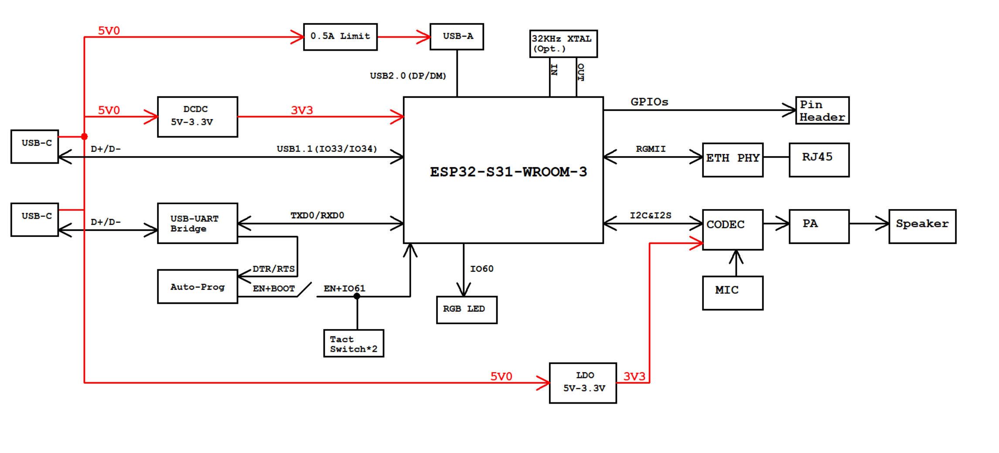

===============================
ESP32-S31-Function-CoreBoard-1
===============================

:link_to_translation:`en:[English]`

本指南将帮助您快速上手 ESP32-S31-Function-CoreBoard-1，并提供该款开发板的详细信息。

ESP32-S31-Function-CoreBoard-1 是一款面向联网 AIoT 原型验证的开发板，搭载 ESP32-S31-WROOM-3 模组，支持 Wi-Fi 6、IEEE 802.15.4、Bluetooth 5.4 (LE + BR/EDR) 与千兆以太网；板载麦克风和扬声器输出接口，关键 IO 全部引出，并支持开箱即用的 AI 语音交互评估。

板上模组的大部分管脚均已引出至排针 **J2**。

.. figure:: ../../_static/esp32-s31-function-coreboard-1/esp32-s31-function-coreboard-1-isometric.png
    :align: center
    :width: 85%
    :alt: ESP32-S31-Function-CoreBoard-1（板载 ESP32-S31-WROOM-3 模组）
    :figclass: align-center

    ESP32-S31-Function-CoreBoard-1（板载 ESP32-S31-WROOM-3 模组）

本指南包括如下内容：

- `入门指南`_：简要介绍了开发板和硬件、软件设置指南。
- `硬件参考`_：详细介绍了开发板的硬件。
- `硬件版本`_：介绍硬件历史版本和已知问题（如有）。
- `相关文档`_：列出了相关文档的链接。
- `免责声明和版权公告`_: 链接到免责声明和版权公告。

入门指南
========

本小节将简要介绍 ESP32-S31-Function-CoreBoard-1，说明如何在 ESP32-S31-Function-CoreBoard-1 上烧录固件及相关准备工作。

组件介绍
--------

.. _user-guide-esp32-s31-function-coreboard-1-callouts:

.. figure:: ../../_static/esp32-s31-function-coreboard-1/esp32-s31-function-coreboard-1-annotated-photo-front.png
    :align: center
    :width: 85%
    :alt: ESP32-S31-Function-CoreBoard-1 - 正面（点击放大）
    :figclass: align-center

    ESP32-S31-Function-CoreBoard-1 - 正面（点击放大）

.. figure:: ../../_static/esp32-s31-function-coreboard-1/esp32-s31-function-coreboard-1-annotated-photo-back.png
    :align: center
    :width: 85%
    :alt: ESP32-S31-Function-CoreBoard-1 - 背面（点击放大）
    :figclass: align-center

    ESP32-S31-Function-CoreBoard-1 - 背面（点击放大）

以下按照顺时针的顺序依次介绍开发板正面和背面上的主要组件。

.. list-table::
   :widths: 10 20 70
   :header-rows: 1

   * - 组件编号
     - 主要组件
     - 介绍
   * - 1
     - J2
     - 所有可用 GPIO 管脚均已引出至排针 J2，便于外接。详情请见 :ref:`user-guide-esp32-s31-function-coreboard-1-header-block`。
   * - 2
     - RJ45 Ethernet Port（RJ45 以太网接口）
     - 支持 10/100/1000 Mbps 自适应的以太网接口。
   * - 3
     - Ethernet Transformer（以太网变压器）
     - 用于 RJ45 以太网接口的变压器模块。
   * - 4
     - USB 2.0 Type-A Port（USB 2.0 Type-A 接口）
     - USB 2.0 Type-A 接口与 ESP32-S31 芯片的 USB 2.0 OTG High-Speed 接口连接，符合 USB 2.0 规范。通过该接口与其他设备通信时，ESP32-S31 作为 USB Host，对外可提供最高 500 mA 电流。
   * - 5
     - USB Serial/JTAG Port（USB 串口/JTAG 接口）
     - USB Type-C 接口，支持 USB 2.0 Full-Speed 速率。可用于向开发板供电、向 ESP32-S31 芯片烧录固件、通过 USB 协议与芯片通信，以及进行 JTAG 调试。
   * - 6
     - USB Type-C to UART Port（USB Type-C 转 UART 接口）
     - 用于向开发板供电、烧录应用程序，以及通过板载 USB 转 UART 桥接器与 ESP32-S31 芯片通信。
   * - 7
     - 3.3 V Power-on LED（3.3 V 电源指示灯）
     - 开发板连接 USB 电源后，该指示灯亮起。
   * - 8
     - J5
     - 用于测量电流。详见章节 `测量电流`_。
   * - 9
     - 5 V to 3.3 V DC/DC Converter（5 V 转 3.3 V DC/DC）
     - 电源稳压电路，将 5 V 输入转换为 3.3 V 输出。
   * - 10
     - ESP32-S31-WROOM-3 （ESP32-S31-WROOM-3 模组）
     - ESP32-S31-WROOM-3 集成 ESP32-S31 芯片，支持 Bluetooth 5.4（LE）及 IEEE 802.15.4（Zigbee/Thread/Matter）等，适用于多种低功耗物联网场景。
   
   
.. list-table::
   :widths: 10 20 70
   :header-rows: 1

   * - 组件编号
     - 主要组件
     - 介绍
   * - 11
     - Microphone（麦克风）
     - 板载麦克风，连接至音频编解码芯片接口。
   * - 12
     - RGB LED
     - 可寻址 RGB 发光二极管，由 GPIO60 驱动。
   * - 13
     - Audio Codec Chip（音频编解码芯片）
     - ES8311 为低功耗单声道音频编解码芯片，包含单通道 ADC、单通道 DAC、低噪声前置放大器、耳机驱动器、数字音效、模拟混音及增益等功能。通过 I2S 与 I2C 总线与 ESP32-S31 芯片连接，为音频应用提供独立于应用软件的硬件音频处理。
   * - 14
     - Reset Button（Reset 键）
     - 按下该键复位 ESP32-S31。
   * - 15
     - Speaker Output Port（扬声器输出端口）
     - 用于连接扬声器。最大输出功率可驱动 4 Ω、3 W 扬声器，引脚间距为 1.25 mm（0.08”）。
   * - 16
     - Boot Button（Boot 键）
     - 下载按键。按住 **Boot** 键的同时按一下 **Reset** 键进入“固件下载”模式，可通过 UART 接口或 USB 串口/JTAG 接口下载固件。
   * - 17
     - Audio PA Chip（音频功率放大器）
     - NS4150B 为低 EMI、3 W 单声道 D 类音频功率放大器，用于放大来自音频编解码芯片的音频信号以驱动扬声器。
   * - 18
     - Ethernet PHY IC
     - 以太网 PHY 芯片，与 ESP32-S31 的 RGMII 接口及 RJ45 以太网接口连接。
   * - 19
     - USB-to-UART Bridge（USB 转 UART 桥接器）
     - 板载单芯片 USB 转 UART 桥接器，与 **USB Type-C 转 UART 接口** 配合，用于向开发板供电、烧录固件以及通过串口与 ESP32-S31 芯片通信。
   * - 20
     - Switch（开关）
     - TPS2051C 为 USB 电源开关，提供 500 mA 输出电流限制。

开始开发应用
------------

通电前，请确保 ESP32-S31-Function-CoreBoard-1 完好无损。

必备硬件
^^^^^^^^

- ESP32-S31-Function-CoreBoard-1
- USB 2.0 数据线（标准 A 型转 Type-C 型）
- 电脑（Windows、Linux 或 macOS）

.. 注解::

  请确保使用适当的 USB 数据线。部分数据线仅可用于充电，无法用于数据传输和编程。

硬件设置
^^^^^^^^

使用 USB 数据线将 ESP32-S31-Function-CoreBoard-1 连接到电脑，可通过任何一个 USB Type-C 端口为开发板供电。

软件设置
^^^^^^^^

请前往 `ESP-IDF 快速入门 <https://docs.espressif.com/projects/esp-idf/zh_CN/latest/esp32s31/get-started/index.html>`__ 小节查看如何快速设置开发环境，将应用程序烧录至您的开发板。

.. 注解::

  开发板使用 USB 端口与电脑通信。大多数操作系统（Windows、Linux、macOS）已预装所需驱动，开发板插入后可自动识别。如无法识别设备或无法建立串口连接，请参考 `与 ESP32-S31 创建串口连接 <https://docs.espressif.com/projects/esp-idf/zh_CN/latest/esp32s31/get-started/establish-serial-connection.html>`__ 获取安装驱动的详细步骤。

乐鑫为多种开发板提供了板级外设管理组件，可帮助您更轻松、高效地初始化和使用板载的主要外设，如 LCD 显示屏、音频芯片、按键和 LED 等。请访问 `ESP Component Registry 上的 esp_board_manager 组件页面 <https://components.espressif.com/components/espressif/esp_board_manager>`__ 查询支持情况。

其他开发框架选项
^^^^^^^^^^^^^^^^^^^^

除了 ESP-IDF 开发框架外，本开发板还支持以下其他开发框架，为不同用户需求和应用场景提供了更多灵活选择：

- 乐鑫 Bluetooth LE 软件生态：通过 ESP-BLE-MESH 与 ESP-BLE-AUDIO 等方案开发低功耗蓝牙相关的应用，加速产品落地与量产。
- `ESP-GMF <https://github.com/espressif/esp-gmf>`__：乐鑫通用多媒体框架，提供音视频处理相关组件，适用于多媒体应用开发。

  - `Wi-Fi 音视频示例 <https://github.com/espressif/esp-gmf/tree/main/gmf_examples>`__：提供多种基于 Wi-Fi 的音视频应用示例，便于在项目中集成与验证。
  - `蓝牙音频 <https://github.com/espressif/esp-gmf/tree/main/packages/esp_bt_audio>`__：提供统一的蓝牙音频开发接口，支持经典蓝牙与 LE Audio。

- `ESP-Matter <https://github.com/espressif/esp-matter>`__：通过 Matter 与 Thread 协议构建设备，适用于低功耗与电池供电场景。

内含组件和包装
---------------

零售订单
^^^^^^^^

如购买样品，每个开发板将以防静电袋或零售商选择的其他方式包装。

零售订单请前往 `购买样品 <https://www.espressif.com/zh-hans/company/contact/buy-a-sample>`__。

批量订单
^^^^^^^^

如批量购买，开发板将以大纸板箱包装。

批量订单请前往 `联系商务 <https://www.espressif.com/zh-hans/contact-us/sales-questions>`__。

硬件参考
========

功能框图
--------

ESP32-S31-Function-CoreBoard-1 的主要组件和连接方式如下图所示。

    ESP32-S31-Function-CoreBoard-1 功能框图（点击放大）

电源选项
^^^^^^^^

您可从以下供电方式中任选其一给开发板供电：

- USB 转 UART 接口供电或 ESP32-S31 USB 接口供电（选择其一或同时供电），默认供电方式（推荐）
- 5V 和 G (GND) 排针供电

测量电流
--------

开发板上的 J5 排针（见图 :ref:`user-guide-esp32-s31-function-coreboard-1-callouts` 中的 J5）可用于测量 ESP32-S31-WROOM-3 模组的电流：

- 移除 J5 跳帽：此时开发板上外设与模组电源断开，在 J5 排针处串联电流表后可测量模组电流。
- 安装 J5 跳帽（出厂默认）：开发板恢复正常功能。

.. _user-guide-esp32-s31-function-coreboard-1-header-block:

排针
----

下表列出了开发板 **J2** 排针的 **名称** 和 **功能**，排针的名称如图 :ref:`user-guide-esp32-s31-function-coreboard-1-callouts` 所示，管脚序号与 `ESP32-S31-Function-CoreBoard-1 原理图`_ (PDF) 一致。

J2
^^

====  =======  ==========  ======================================================
序号  名称     类型 [#]_    功能
====  =======  ==========  ======================================================
1     G        G           接地
2     G        G           接地
3     TX0      I/O/T       U0TXD, GPIO58
4     RXD      I/O/T       U0RXD, GPIO59
5     61       I/O/T       BOOT, GPIO61
6     60       I/O/T       GPIO60 [#]_
7     2        I/O/T       GPIO2
8     G        G           接地
9     0        I/O/T       GPIO0
10    3        I/O/T       GPIO3
11    49       I/O/T       GPIO49
12    1        I/O/T       GPIO1
13    47       I/O/T       GPIO47
14    48       I/O/T       GPIO48
15    45       I/O/T       GPIO45
16    46       I/O/T       GPIO46
17    43       I/O/T       GPIO43
18    44       I/O/T       GPIO44
19    40       I/O/T       GPIO40
20    42       I/O/T       GPIO42
21    39       I/O/T       GPIO39
22    38       I/O/T       GPIO38
23    37       I/O/T       GPIO37
24    36       I/O/T       GPIO36
25    35       I/O/T       GPIO35
26    D0       I/O/T       SDIO_DATA0, GPIO20
27    D1       I/O/T       SDIO_DATA1, GPIO21
28    D2       I/O/T       SDIO_DATA2, GPIO22
29    D3       I/O/T       SDIO_DATA3, GPIO23
30    CLK      I/O/T       SDIO_CLK, GPIO24
31    CMD      I/O/T       SDIO_CMD, GPIO25
32    4        I/O/T       GPIO4
33    G        G           接地
34    G        G           接地
35    3V3      P           3.3 V 电源
36    3V3      P           3.3 V 电源
37    G        G           接地
38    G        G           接地
39    5V       P           5 V 电源
40    5V       P           5 V 电源
====  =======  ==========  ======================================================

.. [#] P：电源；I：输入；O：输出；T：可设置为高阻；G：接地。
.. [#] 用于驱动可寻址 RGB LED（GPIO60）。

硬件版本
========

无历史版本。

相关文档
========

.. only:: latex

   请前往 `esp-dev-kits 文档 HTML 网页版本 <https://docs.espressif.com/projects/esp-dev-kits/zh_CN/latest/{IDF_TARGET_PATH_NAME}/index.html>`_ 下载以下文档。

- `ESP32-S31 技术规格书`_ (PDF)
- `ESP32-S31-WROOM-3 技术规格书`_ (PDF)
- `ESP32-S31-Function-CoreBoard-1 原理图`_ (PDF)
- `ESP32-S31-Function-CoreBoard-1 PCB 布局图`_ (PDF)
- `ESP32-S31-Function-CoreBoard-1 尺寸图`_ (PDF)
- `ESP32-S31-Function-CoreBoard-1 尺寸图源文件`_ (DXF) - 可使用 `Autodesk Viewer <https://viewer.autodesk.com/>`_ 查看

.. _ESP32-S31 技术规格书: https://documentation.espressif.com/esp32-s31_datasheet_cn.pdf
.. _ESP32-S31-WROOM-3 技术规格书: https://documentation.espressif.com/esp32-s31-wroom-3_datasheet_cn.pdf
.. _ESP32-S31-Function-CoreBoard-1 原理图: https://dl.espressif.com/schematics/esp32-s31-function-coreboard-1-schematics.pdf
.. _ESP32-S31-Function-CoreBoard-1 PCB 布局图: https://dl.espressif.com/schematics/esp32-s31-function-coreboard-1-pcb-layout.pdf
.. _ESP32-S31-Function-CoreBoard-1 尺寸图: https://dl.espressif.com/schematics/esp32-s31-function-coreboard-1-dimensions.pdf
.. _ESP32-S31-Function-CoreBoard-1 尺寸图源文件: https://dl.espressif.com/schematics/esp32-s31-function-coreboard-1-dimensions.dxf

有关本开发板的更多设计文档，请联系我们的商务部门 `sales@espressif.com <sales@espressif.com>`_。

免责声明和版权公告
==================

请参阅 :doc:`免责声明和版权公告 <../disclaimer-and-copyright>`。

