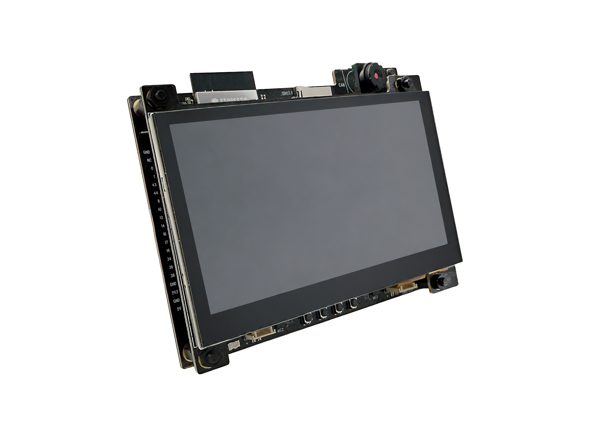
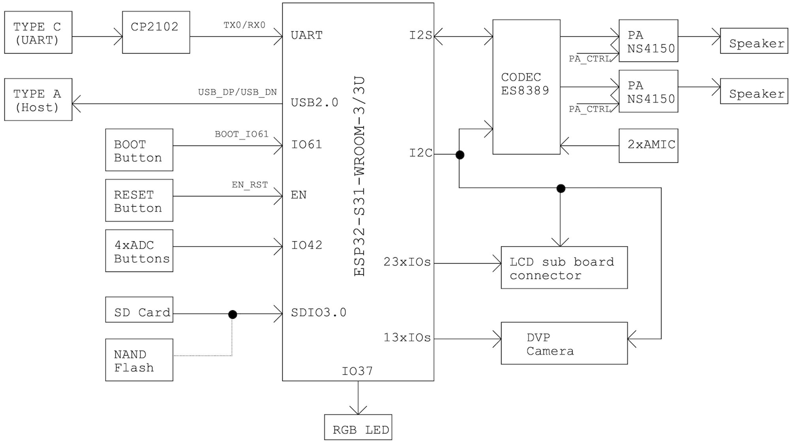
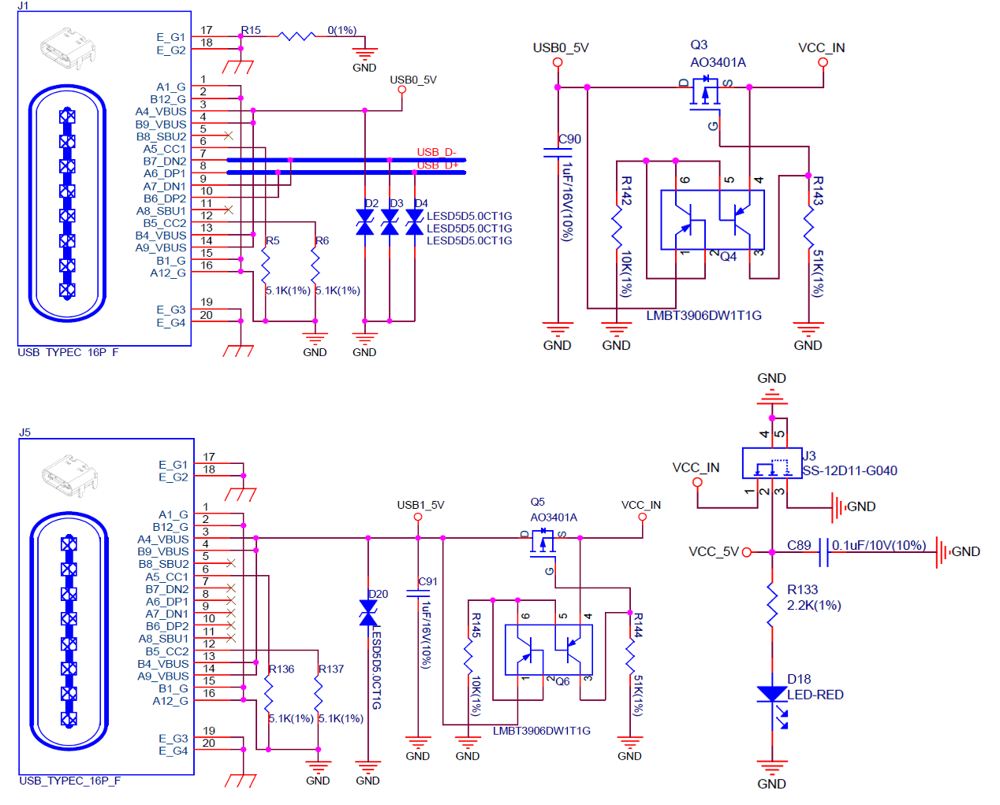
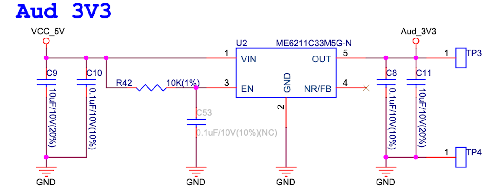
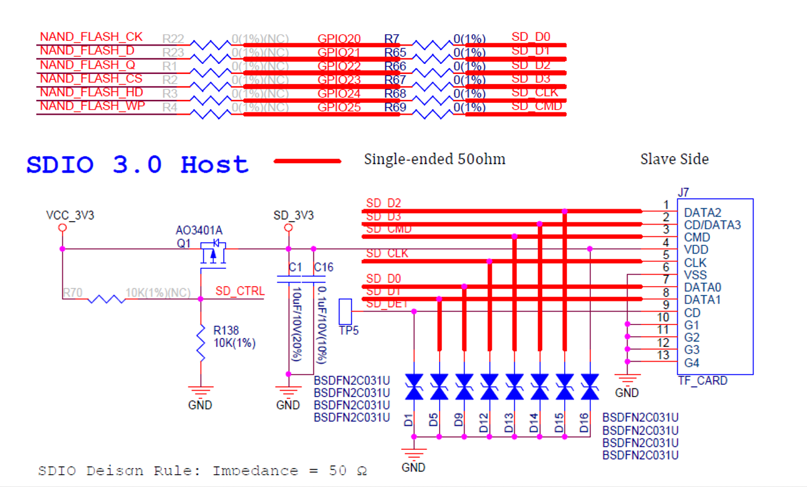
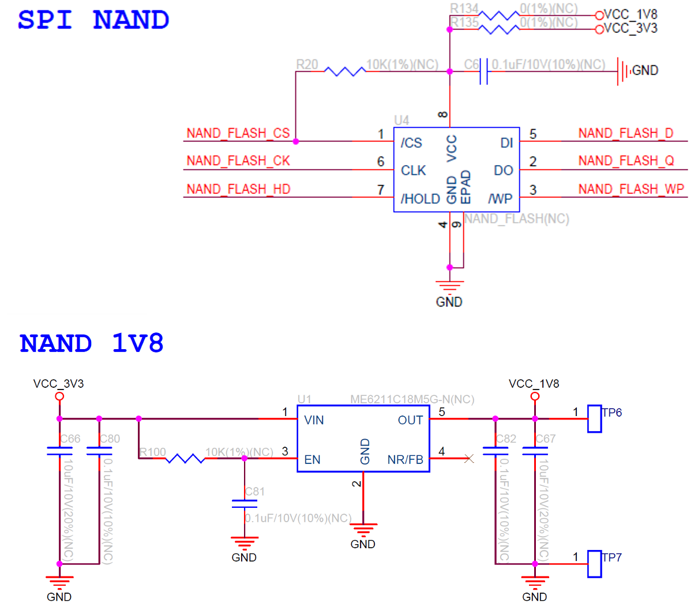

======================
ESP32-S31-Korvo-1 V1.1
======================

:link_to_translation:`en:[English]`

本指南将帮助您快速上手 ESP32-S31-Korvo-1 V1.1，并提供该款开发板的详细信息。

ESP32-S31-Korvo-1 V1.1 是一款基于 ESP32-S31 芯片的多媒体开发板，配备双麦克风阵列，支持语音识别和近/远场语音唤醒。同时它还搭载 LCD、摄像头、microSD 卡等外设，可支持基于 JPEG 的视频流处理，满足用户对低成本、低功耗、联网的音视频与图形界面产品开发需求。

    ESP32-S31-Korvo-1 V1.1（板载 ESP32-S31-WROOM-3 模组）

ESP32-S31-Korvo-1 V1.1 主板可与 LCD 扩展板搭配使用。本文档主要介绍该主板，更多关于 LCD 扩展板的信息将在相关文档就绪后补充。

本指南包括如下内容：

- `入门指南`_：简要介绍了 ESP32-S31-Korvo-1 V1.1 开发板及硬件、软件设置指南。
- `硬件参考`_：详细介绍了 ESP32-S31-Korvo-1 V1.1 的硬件。
- `硬件版本`_：介绍硬件历史版本和已知问题，并提供链接至历史版本开发板的入门指南。
- `相关文档`_：列出了相关文档的链接。

入门指南
========

本小节将简要介绍 ESP32-S31-Korvo-1 V1.1，说明如何在该开发板上烧录固件及相关准备工作。

组件介绍
--------

.. figure:: ../../_static/esp32-s31-korvo-1/esp32-s31-korvo-1-callouts.png
    :align: center
    :width: 100%
    :alt: ESP32-S31-Korvo-1 V1.1（点击放大）
    :figclass: align-center

    ESP32-S31-Korvo-1 V1.1（点击放大）

以下按照顺时针的顺序依次介绍开发板上的主要组件。

.. list-table::
   :widths: 10 20 70
   :header-rows: 1

   * - 组件编号
     - 主要组件
     - 介绍
   * - 1
     - USB Type-C Port (Power)（USB Type-C 供电接口）
     - 仅作开发板的供电接口，无数据通信。
   * - 2
     - USB Type-C Port (UART)（USB Type-C 转 UART 接口）
     - 可用作开发板的供电接口，可烧录固件至芯片，也可作为通信接口，通过板载 USB 转 UART 桥接器与 ESP32-S31 芯片通信。
   * - 3
     - USB-to-UART Bridge（USB 转 UART 桥接器）
     - 单芯片 USB 转 UART 桥接器，可提供高达 3 Mbps 的传输速率。
   * - 4
     - Power Switch（电源开关）
     - 电源开关。拨向 ON 一侧，开发板连接 5 V 电源上电；拨离 ON 一侧，开发板断开 5 V 电源掉电。
   * - 5
     - USB2.0 Type-A Port（USB 2.0 Type-A 接口）
     - USB 2.0 Type-A 接口与 ESP32-S31 芯片的 USB 2.0 OTG High-Speed 接口连接，支持 USB 2.0 标准。通过该接口进行 USB 通信时，ESP32-S31 作为 USB Host 与其它 USB 设备连接，对外提供最高 500 mA 电流。
   * - 6
     - Buck Converter（降压转换器）
     - 用于 3.3 V 电源的降压型 DC-DC 转换器，为系统 3.3 V 供电。
   * - 7
     - 5 V Power-on LED（5 V 电源指示灯）
     - 开发板连接 USB 电源后，该指示灯亮起。
   * - 8
     - Switch（开关）
     - TPS2051C 是一款 USB 电源开关，提供 500 mA 输出电流限制。
   * - 9
     - Right Speaker Output Port（右声道扬声器输出端口）
     - 该输出端口用于连接右声道扬声器。最高输出功率可驱动 4 Ω、3 W 扬声器，引脚间距为 2.00 mm (0.08”)。
   * - 10
     - Right Microphone（右侧模拟麦克风）
     - 右侧板载麦克风，连接至 Audio Codec Chip 接口。
   * - 11
     - 5 V to 3.3 V LDO（5 V 转 3.3 V LDO）
     - 电源转换器，输入 5 V，输出 3.3 V，为音频电路供电。
   * - 12
     - Right Audio PA Chip（右声道音频功率放大器）
     - NS4150B 是一款低 EMI、3 W 单声道 D 类音频功率放大器，用于放大来自音频编解码芯片的音频信号，以驱动扬声器。
   * - 13
     - Function Buttons（功能按键）
     - 四个按键，分别为 PLAY、SET、VOL- 和 VOL+，与 ESP32-S31-WROOM-3 模组连接，借助该 UI 和专用的 API 可以开发和测试音频应用程序。
   * - 14
     - Audio Codec Chip（音频编解码芯片）
     - 音频编解码器芯片 ES8389 是一种低功耗双声道音频编解码器，包含双通道 ADC、双通道 DAC、低噪声前置放大器、耳机驱动器、数字音效、模拟混音和增益功能。它通过 I2S 和 I2C 总线与 ESP32-S31 芯片连接，以提供独立于音频应用程序的硬件音频处理。
   * - 15
     - Left Audio PA Chip（左声道音频功率放大器）
     - NS4150B 是一款低 EMI、3 W 单声道 D 类音频功率放大器，用于放大来自音频编解码芯片的音频信号，以驱动扬声器。
   * - 16
     - Left Microphone（左侧模拟麦克风）
     - 左侧板载麦克风，连接至 Audio Codec Chip 接口。
   * - 17
     - Left Speaker Output Port（左声道扬声器输出端口）
     - 该输出端口用于连接左声道扬声器。最高输出功率可驱动 4 Ω、3 W 扬声器，引脚间距为 2.00 mm (0.08”)。
   * - 18
     - RGB LED
     - 可寻址 RGB 发光二极管，由 GPIO8 驱动。

.. list-table::
   :widths: 10 20 70
   :header-rows: 1

   * - 组件编号
     - 主要组件
     - 介绍
   * - 19
     - 3.3 V to 1.8 V LDO (NC)（3.3 V 转 1.8 V LDO，默认不上件）
     - 电源转换器，输入 3.3 V，输出 1.8 V，为 1.8 V SPI NAND flash 供电，默认不上件。
   * - 20
     - SPI NAND Flash (NC)（默认不上件）
     - 四线 SPI NAND flash，与 microSD 卡复用 ESP32-S31-WROOM-3 信号线，默认不上件。
   * - 21
     - LCD Connector（LCD 子板连接器）
     - 通过连接器外接 LCD 子板。
   * - 22
     - ESP32-S31-WROOM-3 （ESP32-S31-WROOM-3 模组）
     - ESP32-S31-WROOM-3 是通用型模组，支持 2.4 GHz Wi-Fi 6、蓝牙 5.4、经典蓝牙和 IEEE 802.15.4（Zigbee 3.0 和 Thread 1.4）。该模组内置 ESP32-S31 芯片，配置 16 MB SPI flash，同时芯片内置 16 MB PSRAM。ESP32-S31-WROOM-3 采用板载 PCB 天线。
   * - 23
     - microSD Card Slot（microSD 卡槽）
     - 本开发板支持 4-bit 模式的 microSD 卡，可以存储或播放 microSD 卡中的音频文件。支持 SDIO 3.0 协议。
   * - 24
     - 3.3 V to 2.8 V LDO（3.3 V 转 2.8 V LDO）
     - 电源转换器，输入 3.3 V，输出 2.8 V，为外接摄像头模组供电。
   * - 25
     - 3.3 V to 1.5 V LDO（3.3 V 转 1.5 V LDO）
     - 电源转换器，输入 3.3 V，输出 1.5 V，为外接摄像头模组供电。
   * - 26
     - Camera Connector（摄像头连接器）
     - 通过连接器外接摄像头模组至开发板，实现图像传输。
   * - 27
     - Reset Button（Reset 键）
     - 复位按键。
   * - 28
     - Boot Button（Boot 键）
     - 下载按键。按住 Boot 键的同时按一下 Reset 键进入“固件下载”模式，通过串口下载固件。

开发板配件
-------------------

.. _esp32-s31-korvo-1-accessories:

ESP32-S31-Korvo-1 V1.1 的包装内可能附带下列可选配件；主板与配件亦支持单独选购，包括：

- LCD 扩展板：ESP32-S3-LCD-EV-Board-SUB3
- OV3660 摄像头模组

开始开发应用
-------------

通电前，请确保开发板完好无损。

必备硬件
^^^^^^^^

- ESP32-S31-Korvo-1 V1.1
- 一个或两个扬声器
- 两条 USB 2.0 数据线（标准 A 型转 Type-C 型）
- 电脑（Windows、Linux 或 macOS）

.. note::

  请确保使用适当的 USB 数据线。部分数据线仅可用于充电，无法用于数据传输和编程。

可选硬件
^^^^^^^^

- microSD 卡

硬件设置
^^^^^^^^

1. 连接扬声器至 **扬声器输出** 端口。
2. 插入 USB 数据线，分别连接 PC 与开发板的两个 USB 端口。
3. 打开 **电源开关**。
4. 此时，红色电源指示灯应亮起。

.. _esp32-s31-korvo-1-software-setup:

软件设置
^^^^^^^^

请前往 `ESP-IDF 快速入门 <https://docs.espressif.com/projects/esp-idf/zh_CN/latest/esp32s31/get-started/index.html>`__ 小节查看如何快速设置开发环境，将应用程序烧录至您的开发板。

.. 注解::

  开发板使用 USB 端口与电脑通信。大多数操作系统（Windows、Linux、macOS）已预装所需驱动，开发板插入后可自动识别。如无法识别设备或无法建立串口连接，请参考 `与 ESP32-S31 创建串口连接 <https://docs.espressif.com/projects/esp-idf/zh_CN/latest/esp32s31/get-started/establish-serial-connection.html>`__ 获取安装驱动的详细步骤。

乐鑫为多种开发板提供了板级外设管理组件，可帮助您更轻松、高效地初始化和使用板载的主要外设，如 LCD 显示屏、音频芯片、按键和 LED 等。请访问 `ESP Component Registry 上的 esp_board_manager 组件页面 <https://components.espressif.com/components/espressif/esp_board_manager>`__ 查询支持情况。

其他开发框架选项
^^^^^^^^^^^^^^^^^^^^

除了 ESP-IDF 开发框架外，本开发板还支持以下其他开发框架，为不同用户需求和应用场景提供了更多灵活选择：

- 乐鑫 Bluetooth LE 软件生态：通过 ESP-BLE-MESH 与 ESP-BLE-AUDIO 等方案开发低功耗蓝牙相关的应用，加速产品落地与量产。
- `ESP-Brookesia <https://github.com/espressif/esp-brookesia>`__：面向 AIoT 设备的人机交互开发框架，可用于构建图形界面和智能屏显应用。
- `ESP-GMF <https://github.com/espressif/esp-gmf>`__：乐鑫通用多媒体框架，提供音视频处理相关组件，适用于多媒体应用开发。

  - `蓝牙音频 <https://github.com/espressif/esp-gmf/tree/main/packages/esp_bt_audio>`__：提供统一的蓝牙音频开发接口，支持经典蓝牙与 LE Audio。

- `ESP Video Components <https://github.com/espressif/esp-video-components>`__：提供摄像头、视频流和视频处理相关组件，适用于图像采集和视频应用开发。
- `ESP-Matter <https://github.com/espressif/esp-matter>`__：通过 Matter 与 Thread 协议构建设备，适用于低功耗与电池供电场景。

内含组件和包装
---------------

零售订单
^^^^^^^^

如购买样品，每个开发板将以防静电袋或零售商选择的其他方式包装。

零售订单请前往 `购买样品 <https://www.espressif.com/zh-hans/company/contact/buy-a-sample>`__。

批量订单
^^^^^^^^

如批量购买，开发板将以大纸板箱包装。

批量订单请前往 `联系商务 <https://www.espressif.com/zh-hans/contact-us/sales-questions>`__。

硬件参考
========

功能框图
--------

ESP32-S31-Korvo-1 V1.1 的主要组件和连接方式如下图所示。

    ESP32-S31-Korvo-1 V1.1 电气功能框图（点击放大）

供电说明
--------

USB 供电
^^^^^^^^^^^^^^

两个 USB Type-C 口都可以为开发板供电，其中 Power 口仅用于供电，UART 口可以供电，也可以用于数据传输。当外接大功率喇叭，以及同时使用 USB Type-A 口对外供电时，需要确保开发板总的输入电流满足 3A。USB 供电使用专用的数据线，与用于上传应用程序的 USB 数据线分开。

    ESP32-S31-Korvo-1 V1.1 - USB 电源供电（点击放大）

音频独立供电
^^^^^^^^^^^^^^^^^^^^^^^^

ESP32-S31-Korvo-1 V1.1 可为音频组件提供独立的电源，可降低数字组件给音频信号带来的噪声并提高组件的整体性能。

    ESP32-S31-Korvo-1 V1.1 - 音频供电（点击放大）

microSD 卡与 SPI NAND Flash 功能说明
-------------------------------------

microSD 卡与 SPI NAND flash 功能复用 ESP32-S31-WROOM-3 模组的 GPIO20 ~ GPIO25 管脚。默认使用 microSD 卡功能。如果用户需要切换成 SPI NAND flash 功能，需要进行硬件改焊，即需要删除 R7/R65/R66/R67/R68/R69，上件 R22/R23/R1/R2/R3/R4/C6/R20/U4。另外需要注意，ESP32-S31 支持 1.8 V NAND flash 和 3.3 V NAND flash。若用户使用的是 1.8 V NAND flash，还需要上件 R134/C66/C80/R100/U1/C82/C67；若用户使用的是 3.3 V NAND flash，则需要上件 R135。

    ESP32-S31-Korvo-1 V1.1 - microSD 卡功能（点击放大）

    ESP32-S31-Korvo-1 V1.1 - SPI NAND flash 功能（点击放大）

管脚分配列表
------------

下表为 ESP32-S31-WROOM-3 模组的管脚分配列表（用于控制开发板的特定组件或功能）。

.. container:: wide-table-scroll

   .. list-table:: ESP32-S31-WROOM-3 管脚分配
      :header-rows: 1
      :widths: 9 9 9 9 9 9 9 9 9 9 9

      * - 管脚 [#one]_
        - 名称
        - SDMMC
        - SPI NAND
        - I2S
        - I2C
        - RGB LCD
        - BOOTMODE
        - UART0
        - Other
        - DVP camera

      * - 6
        - GPIO2
        - 
        - 
        - I2S_MCLK
        - 
        - 
        - 
        - 
        - 
        - 

      * - 7
        - GPIO3
        - 
        - 
        - I2S_SCLK
        - 
        - 
        - 
        - 
        - 
        - 

      * - 8
        - GPIO0
        - 
        - 
        - 
        - I2C_SDA
        - 
        - 
        - 
        - 
        - 

      * - 9
        - GPIO1
        - 
        - 
        - 
        - I2C_SCL
        - 
        - 
        - 
        - 
        - 

      * - 10
        - GPIO4
        - 
        - 
        - I2S_LRCLK
        - 
        - 
        - 
        - 
        - 
        - 

      * - 11
        - GPIO5
        - 
        - 
        - I2S_DSIN
        - 
        - 
        - 
        - 
        - 
        - 

      * - 12
        - GPIO6
        - 
        - 
        - I2S_SDOUT
        - 
        - 
        - 
        - 
        - 
        - 

      * - 13
        - GPIO7
        - 
        - 
        - 
        - 
        - 
        - 
        - 
        - PA_CTRL
        - 

      * - 14
        - GPIO8
        - 
        - 
        - 
        - 
        - DB0(B3)
        - 
        - 
        - 
        - 

      * - 15
        - GPIO9
        - 
        - 
        - 
        - 
        - DB1(B4)
        - 
        - 
        - 
        - 

      * - 16
        - GPIO10
        - 
        - 
        - 
        - 
        - DB2(B5)
        - 
        - 
        - 
        - 

      * - 17
        - GPIO11
        - 
        - 
        - 
        - 
        - DB3(B6)
        - 
        - 
        - 
        - 

      * - 18
        - GPIO12
        - 
        - 
        - 
        - 
        - DB4(B7)
        - 
        - 
        - 
        - 

      * - 19
        - GPIO13
        - 
        - 
        - 
        - 
        - DB5(G2)
        - 
        - 
        - 
        - 

      * - 20
        - GPIO14
        - 
        - 
        - 
        - 
        - DB6(G3)
        - 
        - 
        - 
        - 

      * - 21
        - GPIO15
        - 
        - 
        - 
        - 
        - DB7(G4)
        - 
        - 
        - 
        - 

      * - 22
        - GPIO16
        - 
        - 
        - 
        - 
        - DB8(G5)
        - 
        - 
        - 
        - 

      * - 23
        - GPIO17
        - 
        - 
        - 
        - 
        - DB9(G6)
        - 
        - 
        - 
        - 

      * - 24
        - GPIO18
        - 
        - 
        - 
        - 
        - DB10(G7)
        - 
        - 
        - 
        - 

      * - 25
        - GPIO19
        - 
        - 
        - 
        - 
        - DB11(R3)
        - 
        - 
        - 
        - 

      * - 27
        - GPIO20
        - SDIO_DATA0
        - SPI2_CLK(NC)
        - 
        - 
        - 
        - 
        - 
        - 
        - 

      * - 28
        - GPIO21
        - SDIO_DATA1
        - SPI2_D(NC)
        - 
        - 
        - 
        - 
        - 
        - 
        - 

      * - 29
        - GPIO22
        - SDIO_DATA2
        - SPI2_Q(NC)
        - 
        - 
        - 
        - 
        - 
        - 
        - 

      * - 30
        - GPIO23
        - SDIO_DATA3
        - SPI2_CS(NC)
        - 
        - 
        - 
        - 
        - 
        - 
        - 

      * - 31
        - GPIO24
        - SDIO_CLK
        - SPI2_HOLD(NC)
        - 
        - 
        - 
        - 
        - 
        - 
        - 

      * - 32
        - GPIO25
        - SDIO_CMD
        - SPI2_WP(NC)
        - 
        - 
        - 
        - 
        - 
        - 
        - 

      * - 40
        - USB_DP
        - 
        - 
        - 
        - 
        - 
        - 
        - 
        - USB2.0_DP
        - 

      * - 41
        - USB_DM
        - 
        - 
        - 
        - 
        - 
        - 
        - 
        - USB2.0_DM
        - 

      * - 42
        - GPIO33
        - 
        - 
        - 
        - 
        - DB12(R4)
        - 
        - 
        - 
        - 

      * - 43
        - GPIO34
        - 
        - 
        - 
        - 
        - DB13(R5)
        - 
        - 
        - 
        - 

      * - 44
        - GPIO35
        - 
        - 
        - 
        - 
        - DB14(R6)
        - 
        - 
        - 
        - 

      * - 45
        - GPIO36
        - 
        - 
        - 
        - 
        - DB15(R7)
        - 
        - 
        - 
        - 

      * - 46
        - GPIO37
        - 
        - 
        - 
        - 
        - 
        - 
        - 
        - WS2812_CTRL
        - 

      * - 49
        - GPIO38
        - 
        - 
        - 
        - 
        - LCD_CS
        - Boot Mode 0
        - 
        - 
        - GM_FK

      * - 50
        - GPIO39
        - 
        - 
        - 
        - 
        - 
        - Boot Mode 1
        - 
        - SD_CTRL
        - 

      * - 51
        - GPIO40
        - 
        - 
        - 
        - 
        - LCD_PCLK
        - Boot Mode 2
        - 
        - 
        - 

      * - 52
        - GPIO42
        - 
        - 
        - 
        - 
        - 
        - 
        - 
        - ADC BUTTON
        - 

      * - 53
        - GPIO43
        - 
        - 
        - 
        - 
        - LCD_H_EN
        - 
        - 
        - 
        - 

      * - 54
        - GPIO44
        - 
        - 
        - 
        - 
        - LCD_H_SYNC
        - 
        - 
        - 
        - 

      * - 55
        - GPIO45
        - 
        - 
        - 
        - 
        - LCD_V_SYNC
        - 
        - 
        - 
        - 

      * - 56
        - GPIO46
        - 
        - 
        - 
        - 
        - 
        - 
        - 
        - 
        - CAM_D0

      * - 57
        - GPIO47
        - 
        - 
        - 
        - 
        - 
        - 
        - 
        - 
        - CAM_D1

      * - 58
        - GPIO48
        - 
        - 
        - 
        - 
        - 
        - 
        - 
        - 
        - CAM_D2

      * - 59
        - GPIO49
        - 
        - 
        - 
        - 
        - 
        - 
        - 
        - 
        - CAM_D3

      * - 60
        - GPIO50
        - 
        - 
        - 
        - 
        - 
        - 
        - 
        - 
        - CAM_D4

      * - 61
        - GPIO51
        - 
        - 
        - 
        - 
        - 
        - 
        - 
        - 
        - CAM_D5

      * - 62
        - GPIO52
        - 
        - 
        - 
        - 
        - 
        - 
        - 
        - 
        - CAM_D6

      * - 63
        - GPIO53
        - 
        - 
        - 
        - 
        - 
        - 
        - 
        - 
        - CAM_D7

      * - 64
        - GPIO54
        - 
        - 
        - 
        - 
        - 
        - 
        - 
        - 
        - CAM_PCLK

      * - 65
        - GPIO55
        - 
        - 
        - 
        - 
        - 
        - 
        - 
        - 
        - CAM_XCLK

      * - 66
        - GPIO56
        - 
        - 
        - 
        - 
        - 
        - 
        - 
        - 
        - CAM_V_SYNC

      * - 67
        - GPIO57
        - 
        - 
        - 
        - 
        - 
        - 
        - 
        - 
        - CAM_H_SYNC

      * - 68
        - GPIO58
        - 
        - 
        - 
        - 
        - 
        - 
        - U0TXD
        - 
        - 

      * - 69
        - GPIO59
        - 
        - 
        - 
        - 
        - 
        - 
        - U0RXD
        - 
        - 

      * - 70
        - GPIO60
        - 
        - 
        - 
        - 
        - LCD_MOSI
        - Boot Mode 3
        - 
        - 
        - 

      * - 71
        - GPIO61
        - 
        - 
        - 
        - 
        - LCD_SCK
        - Boot Mode 4
        - 
        - 
        - 

.. [#one] 管脚 - ESP32-S31-WROOM-3 模组管脚号，不含 GND 和供电管脚。

硬件设置选项
----------------------

自动下载
^^^^^^^^^^^^^^^^^^^^^^

可以通过两种方式使 ESP 开发板进入下载模式：

- 手动按下 Boot 和 RST 键，然后先松开 RST，再松开 Boot 键。
- 由软件自动执行下载。软件利用串口的 DTR 和 RTS 信号来控制 ESP 开发板的 EN、IO0 管脚的状态。详情请参见 `ESP32-S31-Korvo-1 V1.1 原理图`_ (PDF)。

硬件版本
============

  - ESP32-S31-Korvo-1 V1.1：

    采用哑光黑色油墨，PCB 尺寸变大，LCD 子板安装之后叠放在主板之上。GPIO 配置与 V1.0 一样。

  - ESP32-S31-Korvo-1 V1.0：

    首版，采用绿色油墨，LCD 子板安装之后延伸至板外，板内功能露出，方便调试。

相关文档
========

.. only:: latex

   请前往 `esp-dev-kits 文档 HTML 网页版本 <https://docs.espressif.com/projects/esp-dev-kits/zh_CN/latest/{IDF_TARGET_PATH_NAME}/index.html>`_ 下载以下文档。

- `ESP32-S31-Korvo-1 V1.1 原理图`_ (PDF)
- `ESP32-S31-Korvo-1 V1.1 PCB 布局图`_ (PDF)
- `ESP32-S31-Korvo-1 V1.1 尺寸图`_ (PDF)
- `ESP32-S31-Korvo-1 V1.1 尺寸图源文件`_ (DXF) - 可使用 `Autodesk Viewer <https://viewer.autodesk.com/>`_ 查看
- `ESP32-S31-Korvo-1 V1.1 3D打印外壳`_ (STL & STEP) - 可下载3D打印外壳文件

.. _ESP32-S31-Korvo-1 V1.1 原理图: https://dl.espressif.com/schematics/esp32-s31-korvo-1-schematics.pdf
.. _ESP32-S31-Korvo-1 V1.1 PCB 布局图: https://dl.espressif.com/schematics/esp32-s31-korvo-1-pcb-layout.pdf
.. _ESP32-S31-Korvo-1 V1.1 尺寸图: https://dl.espressif.com/schematics/esp32-s31-korvo-1-dimensions.pdf
.. _ESP32-S31-Korvo-1 V1.1 尺寸图源文件: https://dl.espressif.com/schematics/esp32-s31-korvo-1-dimensions.dxf
.. _ESP32-S31-Korvo-1 V1.1 3D打印外壳: :: https://github.com/espressif/esp-dev-kits/tree/master/examples/esp32-s31-korvo

有关本开发板的更多设计文档，请联系我们的商务部门 `sales@espressif.com <sales@espressif.com>`_。
