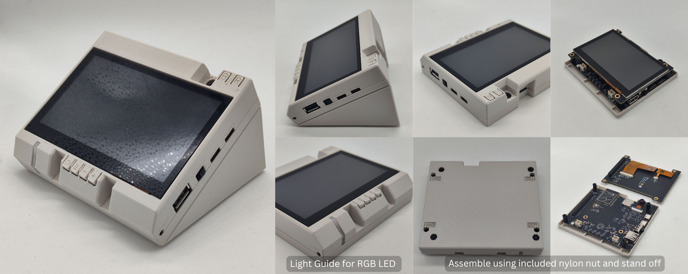

# ESP32-S31-Korvo Development Board

## User Guide

* ESP32-S31-Korvo-1 - [English](https://docs.espressif.com/projects/esp-dev-kits/en/latest/esp32s31/esp32-s31-korvo-1/user_guide.html) / [中文](https://docs.espressif.com/projects/esp-dev-kits/zh_CN/latest/esp32s31/esp32-s31-korvo-1/user_guide.html)

## Examples

The following examples are recommended to be developed with the ESP-IDF **master** branch.

* [Factory Demo](./examples/factory_demo/)

## 3D Printed Case

The following 3D model is a four-part case you can 3D print for your ESP32-S31-Korvo-1. Do note that with all 3D Printed products, there will be a variance in tolerance and fitting. Your success may vary.

- [ESP32-S3-Korvo-1 Top Case](./3d-printed-case/ESP32-S31-Korvo-1_Case_top_20260603.STL)
- [ESP32-S3-Korvo-1 Bottom Case](./3d-printed-case/ESP32-S31-Korvo-1_Case_btm_20260603.STL)
- [ESP32-S3-Korvo-1 Light Guide](./3d-printed-case/ESP32-S31-Korvo-1_Case_light_guide_20260603.STL)
- [ESP32-S3-Korvo-1 Stand](./3d-printed-case/ESP32-S31-Korvo-1_Case_stand_20260603.STL)

See [3D Printed Case](./3d-printed-case) folder for STEP files

|| 
|:--:| 
|ESP32-S31-Korvo-1 - Case 3D printed on [BambuLab P1S](https://bambulab.com/en/p1)|

